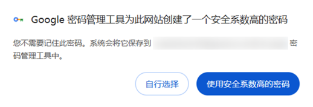
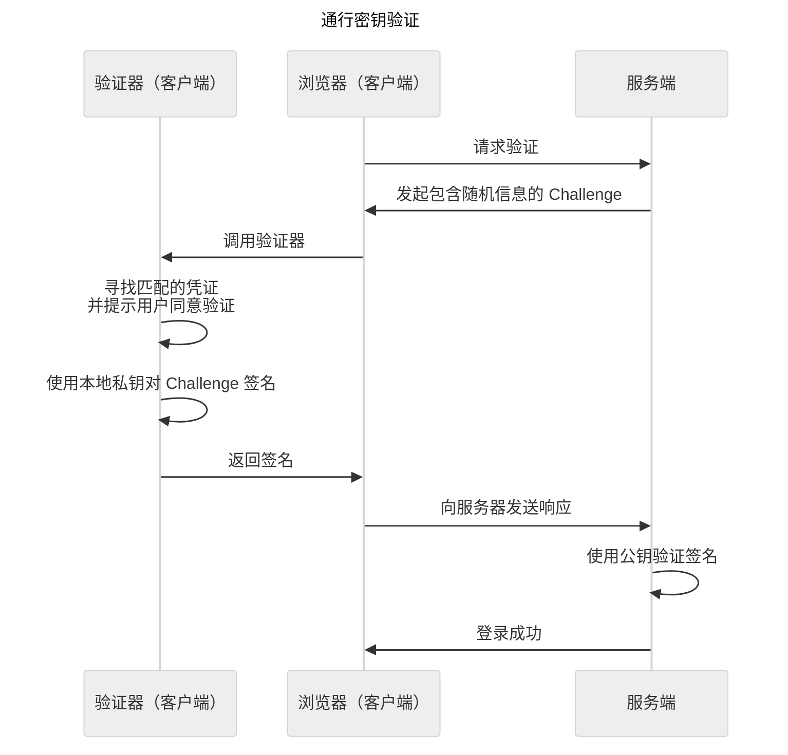
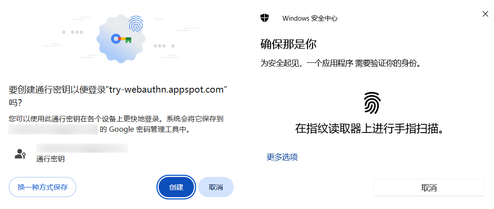

# 2FA、“无密码”和账户登录的未来

## 从 SFA 到 2FA

输入用户名、密码，然后点击“登录”。  
**密码** 无疑是最常用的账号登录方式，符合直觉、也并不繁琐，基于密码的 **SFA**[^1]、即 **单因素验证** 是许多网站使用的主要登录方式。  
但弱口令、密码泄露等问题正使得纯密码的身份验证变得越来越不可信。  
一些密码管理器程序通过 **生成密码** 的功能帮助用户在不同网站使用不同的、安全性高的密码，在一定程度上降低了撞库和暴力破解的风险。例如 Chrome 就提供了生成高安全系数密码的功能。



[^1]: Single-factor authentication

即便如此，单因素验证也并非账号登录的最优解。在此之上，为了更安全地验证“你是你”，**2FA**[^2]、即 **双因素验证** 应运而生。在密码的基础上，从登录 QQ 和微信时的短信验证码、到 Steam 令牌都属于 2FA。  
2FA 通过两个验证因素来验证用户的身份，这些因素包括：知识（密码、验证问题）、拥有（物理密钥、OTP）、固有（生物特征）、地点（物理位置）等[^12]。2FA 能降低密码泄露、弱密码等情况下账户被盗的风险。

[^12]: [Multi-factor authentication](https://en.wikipedia.org/wiki/Multi-factor_authentication#Authentication_factors) - Wikipedia


## OTP[^3]

上面提到的短信验证码和 Steam 令牌都属于 **OTP**、即 **一次性密码**，是 2FA 中的一种因素，通过一个具有时效性的密码来验证用户身份，这是一种被广泛使用的验证方式，银行 U 盾（硬件令牌）生成的验证码也属于 OTP。

**短信、邮箱等验证码验证** 非常常用，但也存在着费用高昂、被滥用等问题。国内一些平台采用了“无感知校验”的“号码认证服务”（PNVS），实现了无验证码的手机验证。

**基于 HMAC 的一次性密码算法**（**HOTP**[^4]） / **基于时间的一次性密码算法**（**TOTP**[^5]）是另外一种常用的 OTP 类型，用户需要提交客户端显示的验证代码来证明自己的身份，Steam 令牌就采用了类似的算法[^6]。  
这里介绍一种 Github 等平台使用的开源 TOTP 方法：

0. 用户需要使用 [Google 身份验证器](https://support.google.com/accounts/answer/1066447?hl=zh-Hans) 或 [Microsoft Authenticator](https://www.microsoft.com/zh-CN/security/mobile-authenticator-app) 等应用来获取 TOTP 验证码。在注册时，平台会向用户提供一个二维码（或链接），用户需要在验证器应用中扫描这个二维码来添加 TOTP；在登录时，用户需要在网站中输入验证其中显示的动态密码以验证身份。

1. 在 **HOTP** 验证中，服务端和客户端都拥有同一个不变的 Secret，以及一个变化的、双方约定好计算方法的 C 值（验证次数）。  
    验证时，双方分别通过 HMAC 算法，传入 Secret 与 C 值，生成哈希值 HS；  
    然后，对计算出的哈希值 HS 进行截取、处理，最终得到 6 位的 OTP；  
    最后，由用户向服务端提供其生成的 OTP，服务端校验用户提供的 OTP 是否与服务端生成的 OTP 一致。

2. **TOTP** 基于 HOTP，在 TOTP 中，变化的 C 值是由当前时间计算得到的。这是 [一种 HOTP / TOTP 算法的 JavaScript 实现](totp.html) 可供体验：

    ```javascript
    /**
     * 解码 Base 32 Secret
     * @param {string} b32 Base 32 编码的 Secret
     * @return {Uint8Array} 解码与转换后的 Secret
     */
    const b32KeyDecode = (b32) => {
        // 将 Base 32 编码转换为二进制 String
        // 参考：Base64, Base32 和 Base16，用通俗的语言深入到内部 - JMRVix的文章 - 知乎
        // https://zhuanlan.zhihu.com/p/51316306
        let bin = '';
        b32 = b32.replaceAll('=', '').toUpperCase();
        b32.split('').forEach(c => {
            bin += 'ABCDEFGHIJKLMNOPQRSTUVWXYZ234567'.indexOf(c).toString(2).padStart(5, '0');
        });
        // 将二进制 String 转换为 Uint8Array
        let view = new Uint8Array(Math.max(1, bin.length / 8));
        for (let i = 0; i < bin.length; i += 8) {
            view[i / 8] = parseInt(bin.slice(i, i + 8), 2);
        }
        return view;
    };

    /**
     * HOTP 实现
     * 参考：RFC 4226 - HOTP: An HMAC-Based One-Time Password Algorithm
     * https://datatracker.ietf.org/doc/html/rfc4226
     * @param {string} k Base 32 编码的 Secret
     * @param {number} c 计数器
     * @return {string} 6 位 OTP
     */
    const hotp = (k, c) => {
        return new Promise(async (resolve, reject) => {
            // I. 以 HMAC SHA-1 算法生成 HS
            // a. 从 Secret 生成 Key
            const key = await crypto.subtle.importKey("raw", b32KeyDecode(k), { name: "HMAC", hash: "SHA-1" }, false, ["sign"]);
            // b. 从 Counter 生成 Data
            const data = new DataView(new ArrayBuffer(8));
            data.setUint32(4, c);
            // c. HMAC-SHA-1(Key, Data)，并将 Uint8Array 类型的结果存入 HS
            const sign = await crypto.subtle.sign("HMAC", key, data);
            const HS = new DataView(sign);
            // II. 截留生成的 HS
            // a. 获取 Offset 值
            const offset = HS.getInt8(19) & 15;
            // b. 获取从第 Offset 位起的 32 位 unsigned int（4 字节），按标准取后 31 位，并 mod 6 得到 6 位 OTP
            const otp = (HS.getUint32(offset) & 0x7fffffff) % Math.pow(10, 6);
            // c. 转 string、补 0 并返回
            resolve(otp.toString().padStart(6, '0'));
            // console.log(b32KeyDecode(k), key, data, sign, HS, offset, otp);
        });
    }

    /**
     * TOTP 实现
     * 参考：RFC 6238 - TOTP: Time-Based One-Time Password Algorithm
     * https://datatracker.ietf.org/doc/html/rfc6238
     * @param {string} k Base 32 编码的 Secret
     * @param {number} t UNIX 时间戳
     * @return {string} 6 位 OTP
     */
    const totp = (k, t) => {
        const t0 = 0, p = 30;
        return hotp(k, Math.floor((t - t0) / p));
    }
    ```

    解释如下[^7][^8]：

    1. 默认 TOTP 参数：  
        1. `the time step in seconds` 时间步长 X = 30
        2. `the Unix time to start counting time steps` 起始 UNIX 时间 T0 = 0
        3. `number of digits` 验证码位数 Dight = 6

    2. 计算 C 值，若当前 UNIX 时间戳为 T，则 C 值为 $\frac{T - T0}{X}$ 的向下取整。

    3. 一般地，Secret 由 Base32 编码，以 Base32 解码 Secret、得到密钥 K。

    4. 执行 HMAC SHA-1 算法，得到 20 字节的 HS = HMAC-SHA-1(K,C).

    5. 进行截取，下面是一个生成的 HS 示例（摘自 RFC 4226）。
    
        ```
        -------------------------------------------------------------
        | Byte Number                                               |
        -------------------------------------------------------------
        |00|01|02|03|04|05|06|07|08|09|10|11|12|13|14|15|16|17|18|19|
        -------------------------------------------------------------
        | Byte Value                                                |
        -------------------------------------------------------------
        |1f|86|98|69|0e|02|ca|16|61|85|50|ef|7f|19|da|8e|94|5b|55|5a|
        -------------------------------***********----------------++|
        ```

        1. 取第 20 字节的低 4 位（即上例的 `a`，十进制为 10）作为偏移量 Offset（$0\leq Offset\leq 15$）。
        2. 截取第 Offset 字节起 4 个字节（即上例中第 10 到 13 字节，`50 ef 7f 19`），取其后 31 位[^9]返回 D。
    
    6. 对 D 取模 $10^{Digit}$（，转换为 String，补 0），得到 6 位 OTP。

    为了降低客户端 - 服务端时间差带来的影响（抑或 HOTP 中客户端的“验证次数”意外增加）、并避免暴力破解，在生产环境验证中，还存在：

    1. `throttling parameter` 限制参数 T：服务端会在用户验证失败 T 次后拒绝用户的连接。
    2. `resynchronization parameter` s：服务端会尝试 s 范围内的 C 值。

以 HOTP / TOTP 作为 2FA 相比短信、邮箱验证码验证可能更具优势，例如能避免手机短信被恶意软件获取导致账号被盗、避免账号和手机号绑定、减少更换手机号时带来的麻烦，以及成本较低等。

## Passkey

近年来，Google、微软等公司都在推动“无密码登录”[^10][^14]，被称为 **通行密钥**，即 **Passkey**。通行密钥的核心是非对称加密算法，其中私钥始终储存在用户端；在登陆时，服务端向客户端发起 Challenge（质询 / 挑战），客户端使用私钥对请求进行签名并返回以证明身份[^11]。  




使用通行密钥的用户只需要在登陆时通过指纹或 PIN 等方式验证自己的身份，加快了登录的流程、降低了密码或生物信息泄露的风险。同时，用户也可以选择使用密码管理器跨设备同步自己的通行密钥。通行密钥正在成为一些平台中与密码并行的另外一种登录方案。



通行密钥执行 FIDO2 标准。FIDO2 标准由 FIDO 联盟推出，“FIDO2 使用户能够利用普通设备在移动和桌面环境中轻松验证在线服务”[^13]。

各个平台都在陆续支持通行密钥，例如 [Web Authentication API](https://developer.mozilla.org/zh-CN/docs/Web/API/Web_Authentication_API)、[Android Credential Manager API](https://developers.google.com/identity/android-credential-manager?hl=zh-cn)、[Supporting passkeys (Apple)](https://developer.apple.com/documentation/authenticationservices/supporting-passkeys)。  
这是 [一个 Google 提供的 WebAuthn 演示](https://try-webauthn.appspot.com/) 可供体验，对于详细的 WebAuthn（通行密钥实现）流程，可以参考 [Web Authentication API #注册](https://developer.mozilla.org/zh-CN/docs/Web/API/Web_Authentication_API#%E6%B3%A8%E5%86%8C)。

## 展望

从最初以密码验证的 SFA、到不断发展的 2FA，再到今天逐渐推广的通行密钥，**基于知识的身份验证** 正在转向 **基于占有的身份验证**[^13]，使得账户登录愈加安全、快速。  
尽管如此，钓鱼、凭据泄露等因素仍使盗号问题挥之不去，通行密钥在国内尚未成为主流，云服务间的隔阂增加了设备间同步通行密钥的成本，“无密码未来”仍需行业进一步达成共识、协同推进。

[^2]: Two-factor authentication，属于 Multi-factor authentication、即多因素验证的一种。

[^3]: One-time password

[^4]: HMAC-based one-time password

[^5]: Time-based one-Time password

[^6]: [Steam令牌算法分析 - 紫金校尉的文章 - 知乎](https://zhuanlan.zhihu.com/p/554017567)

[^7]: [RFC 4226 - HOTP: An HMAC-Based One-Time Password Algorithm](https://datatracker.ietf.org/doc/html/rfc4226)

[^8]: [RFC 6238 - TOTP: Time-Based One-Time Password Algorithm](https://datatracker.ietf.org/doc/html/rfc6238)

[^9]: “掩去最高位的原因是为了避免在取模运算中关于有符号和无符号的混淆。不同者处理的方式不同，掩去符号位能避免歧义。”（译自 RFC 4226）

[^10]: [微软、谷歌、苹果大力推动 无密码登录时代明年可待 - 联合早报](https://www.zaobao.com.sg/lifestyle/gadget/story20220605-1279750)

[^11]: [What is FIDO2?](https://www.microsoft.com/en-us/security/business/security-101/what-is-fido2) - Microsoft

[^13]: [FIDO 身份验证](https://fidoalliance.org/fido2/?lang=zh-hans) - FIDO Alliance

[^14]: Chrome、Safari、Edge、Firefox 等主流浏览器在 2018 年前后开始支持 Web Authentication API。