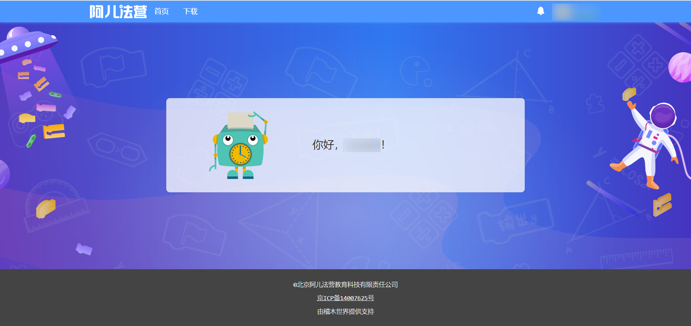

## 目录

- [**前言**](#前言)
- [**2020 年初及以前的 A 营**](#2020%20年初及以前的%20A%20营)
  - [A 营社区的初创](#A%20营社区的初创)
  - [2020 年以前 A 营的社区机制](#2020%20年以前%20A%20营的社区机制)
- [**2020 年 - A 营的兴盛**](#2020%20年%20-%20A%20营的兴盛)
  - [走向“大众社区”的 A 营](#走向“大众社区”的%20A%20营)
  - [2020 年间的功能更新](#2020%20年间的功能更新)
  - [A 营的管理员制度和社区日常管理](#A%20营的管理员制度和社区日常管理)
- [**2021 年 - A 营的转折**](#2021%20年%20-%20A%20营的转折)
  - [从“功能创新”到“缝缝补补”](#从“功能创新”到“缝缝补补”)
  - [精华作品的变化](#精华作品的变化)
  - [社区环境与文化的发展与转变](#社区环境与文化的发展与转变)
- [**2022 年 - 失落的开端**](#2022%20年%20-%20失落的开端)
  - [恶性事件对社区造成冲击](#恶性事件对社区造成冲击)
  - [“仅好友可见”机制及其争议](#“仅好友可见”机制及其争议)
- [**2023 年和 2024 年 - 走向混乱**](#2023%20年和%202024%20年%20-%20走向混乱)
- [**2025 年**](#2025%20年)
- [**写在最后**](#写在最后)
- [**附录 - 社区功能详解**](#附录%20-%20社区功能详解)
  - [精华作品](#精华作品)
  - [道具、货币和任务系统](#道具、货币和任务系统)
  - [“能力图”、等级和 VIP](#“能力图”、等级和%20VIP)
  - [Scratch 扩展](#Scratch%20扩展)

## 前言

<u>“A 营”的全称是**阿儿法营**（Aerfaying），是一个 Scratch 社区</u>。  
作者从 2020 年开始在 A 营活跃，2020 年中旬开始参加 A 营的管理员工作，这篇文章在 2023 年 9 月初开始编写，旨在尽可能客观、完整、系统性的阐释 A 营社区的发展历程。

## 2020 年初及以前的 A 营

2010 年，宇（余宙华老师）创办“阿尔法营--魔抓编程培训基地”，主要经营少儿编程教育。2013 年，北京阿儿法营教育科技有限责任公司成立。

### A 营社区的初创

<u>2014 年左右</u>，<u>宇邀请守护煮（叶钧老师）加入了 A 营公司</u>，<u>不久后 A 营社区创立</u>。<u>守护煮是至今 A 营社区的重要开发者、管理者</u>，宇评价“这个系统（A 营社区）开发uid1（守护煮）居功至伟”。

> 阿儿法营是我在2010年创办的一个机构，因为我儿子喜欢打游戏，我觉得学学编程符合他的兴趣，对他未来的成长大有裨益。这就是阿儿法营创办的初衷。一开始的时候，我只是去小学里面授课，也在自己的教室里招收学生，持续教学4年后，全力邀请社区uid1加入阿儿法营，他是我前同事，好朋友，一位优秀的工程师。因为我想做一个国内的社区可以让同学们发布自己的编程作品、互相交流、结成友谊（当然，我没想的是同学们还那么好战，显然“有人的地方就有派系，有人的地方就有政治”，当然这是后话了）。
>
> 在被我游说后，uid1放弃了自己稳定的高薪工作，开始和我一起做少儿编程教育（有的同学说A营社区谜题收费，似乎颇有怨言，呵呵，我明白地说吧，社区开放投入持续近十年，主要支出是开发工程师的工资，劳务开支就超过数百万。那么谜题收费是多少呢？也许有两、三万吧，连服务器的支付费用都不够。我个人做了很多谜题，很多同学也玩过，水平不高，但是至今分文未取，为何？因为实在是太少了，取不到啊）
>
> （[如何评价国内Scratch社区阿儿法营？ - 余宙华的回答 - 知乎](https://www.zhihu.com/question/450594913/answer/3064432223)，节选）

注：因为守护煮在社区中的用户 ID 为 1，因此被称为“uid1”。

社区创立初期的用户主要是 A 营少儿编程教育的学员和老师。随着社区的开放和完善，社区的知名度和用户数量逐渐上升。

在 A 营中发现作品有两个主要渠道——主页和发现页。主页推荐分为精华作品和热门作品两部分，前者是最近的精华作品，后者由算法根据点赞、观看等数据自动产生；而发现页默认展示最新发布的作品。因此在 A 营中作品的“引流”渠道几乎均由用户而非官方主导，对新用户的发展较为友好。

2020 年以前，Scratch 圈子里体量最大的社区之一是网易卡搭社区。卡搭社区兴起于 2018 年，但随着卡搭社区的扩大，其社区环境逐渐变差，加上后期官方的经营不力，很多用户离开了卡搭社区，这个社区也在改名“有道卡搭”的一段时间后关闭了社区服务，改为了“素质教育平台”。许多原卡搭社区的用户进入了 A 营发展，被称为“卡搭移民潮”。

### 2020 年以前 A 营的社区机制

<u>A 营在 2020 年以前就有着**丰富的社区机制和功能**</u>，主要包括：

- <u>**精华作品**：社区内的优秀作品会被授予初级、中级、高级、史诗或传说级的“精华作品”。精华作品在 2020 年后主要通过用户“投票”的方式来评选，作品被授予精华作品后作品作者会获得奖励和作品被推荐的机会，同时精华作品也被认为是荣誉与创作能力的证明。</u>

  

- <u>**道具、货币和任务系统**：在社区中通过以完成任务为主的途径获取经验值、社区内货币（金币）和社区内道具，并使用社区内货币购买社区内道具。</u>

  

- <u>**“能力图”、等级和 VIP**：社区会根据用户在社区内的表现生成量化的能力图。</u>
- <u>**Scratch 扩展**：A 营有相对同期其他社区较为丰富的 Scratch 扩展，为依赖于社区扩展的作品的出现奠定了基础。</u>

**（在附录中有以上社区功能的详细介绍，对社区功能和机制不了解的朋友可以移步文章末尾阅读附录中的介绍）**

这些机制<u>丰富了 A 营社区的用户体验</u>，让 A 营在社区机制和功能上领先于同期的很多其他社区；但是在社区走向“大众化”后，<u>某些复杂的社区机制在一定程度上也提高了 A 营的使用门槛</u>，例如一些新加入社区的用户很可能会不经意间违反社区规定，使得能力图中的“声望”值降低，导致使用社区的不便。

## 2020 年 - A 营的兴盛

### 走向“大众社区”的 A 营

<u>2020 年 2 月，由于新型冠状病毒疫情，全国展开线上教学，大量用户进入 A 营，社区的作品数量和质量提高、活跃用户数增加，在短短的几个月内 A 营的知名度就大幅上升、赢得了良好的口碑，成为了在当时用户体量和社区环境都较为领先的一个社区。</u>

<u>在 2020 年中上旬（全国线上教学期间），A 营的活跃度达到顶峰。</u>

<u>2020 年上旬，守护煮持续在社区中活跃，和用户建立了良好的关系</u>。社区有时无法访问的情况被戏称为“（守护者）把咖啡撒到服务器上了”，守护煮便因此更改了原先的用户名“守护者”为“守护煮”，并推出了咖啡头像挂件，这也是守护煮被称为“煮”的原因。

但是，在社区的发展和繁荣背后，用户素质良莠不齐也导致了<u>社区环境出现了下滑</u>，如打广告和“求精”（向有精华作品的用户“求”精华选票）一类的行为开始增加。

### 2020 年间的功能更新

<u>在 2020 年的兴盛期，社区推出了包括论坛、挖矿机器人、拍卖行和新 Scratch 拓展在内的一系列功能更新，进一步的丰富了社区的功能。</u>

- 挖矿机器人与拍卖行：2020 年 3 月推出，用户通过购买“挖矿机器人”道具来参与类似数字货币挖矿的竞争性活动获得包括金币、经验、矿物道具和图纸道具在内的奖励，矿物道具和图纸道具可以在拍卖行和其它用户交易以获得更多的金币收益。
- 论坛：2020 年 6 月推出，补全了社区功能的短板、也为用户提供了交流和反馈的空间。

**（在附录中有以上社区功能的详细介绍）**

### A 营的管理员制度和社区日常管理

守护煮曾经提出过<u>“学生自治”</u>这一概念，即学生自治社区。

“学生自治”在实际的执行中则是体现为<u>社区的日常管理绝大部分由来自用户的管理员志愿完成</u>。守护煮作为社区经营方，掌管着社区机制、管理员任免等事务。

<u>社区的日常管理事务包括审核举报、处理违规等</u>，在管理的过程中，管理员有通过/驳回举报、提醒/警告违规行为、路障、禁言、提请封号等权力。（路障是社区内最常用的管理道具之一，对违规的页面使用路障可以使其暂时对普通用户不可见，进行路障的同时也可以附加扣除金币和声望的罚单）

<u>2020 年 4 月，A 营建立预备役管理员制度</u>。当时设置了 8 个预备役小组，用户通过邀请或选拔（后期主要为通过招新考试选拔）加入预备役小组，在预备役小组中参与精华审核等日常任务，并在通过转正考试、管理员公会表决后方可成为正式管理员。<u>此举使更多的普通用户获得了成为社区管理员、直接参与社区管理的机会</u>。

管理员预备役的招新、转正考试以考察社区知识、管理能力为主，考查编程及学科能力为辅，一般在假期举办，由社区内的正式或预备役管理员命题。

> 7. 处理违规，要根据情况选择惩罚。下列不属于提醒或警告的是（   ）  
>    A. 路障无罚单     B. 禁言     C. 留言劝阻     D. 私聊劝阻
>
> （2022年1月阿儿法营预管第六届综合素养测评，节选）

但是这样的模式在实际执行中也<u>存在一定的局限性和问题</u>，如：原社区规定模糊、实际情形多变、不同管理员处理违规行为的标准无法完全统一；一些行为被批评为“形式主义”；守护煮很少参与社区日常管理，但却在决定社区机制、干预管理任免等上有极大的权力和话语权。 同时，有人对“学生自治”模式提出了质疑，认为学生自己的时间、阅历和能力有限，让学生来管理社区本身就是不负责任的行为。

## 2021 年 - A 营的转折

> 普通用户非辱骂性质的使用“草”原则上属于非违规行为
> 
> （[阿儿法营/稽木世界普通用户使用规则及处罚条例（草案）](https://gitblock.cn/Studios/10002/Forum/PostView?postId=19345)，节选）

2020 年末，流行语“草”在社区内流行，意为“笑”。守护煮认为“草”与不文明用语谐音，提出禁止预备役及正式管理员使用“草”，引发了大量的讨论，有用户认为守护煮此举体现出他与年轻用户间存在着“时代鸿沟”。  
时至今日，发布包含“艹”等“疑似不文明用语”的内容时仍会被提示：“正在提交的内容中包含疑似不文明用语，请仔细核实并慎重选择用词方式！如果是正常表达，可以点击确定按钮继续提交”。

### 从“功能创新”到“缝缝补补”

2020 年下旬，全国线上教学基本结束，大部分地区恢复正常教学。线上教学结束后，<u>社区活跃度下降</u>，但是社区环境上已经存在的乱象和问题却并未随着活跃度下降而褪去，反而还<u>出现了更多的“**捣乱**”（即恶意违规破坏社区秩序）行为</u>，如大规模发布广告的“广告机”和“盗号捣乱”现象。

对于上面提到的状况，守护煮于 2020 年末<u>推出了**能量条**的机制</u>，用户进行操作会消耗能量，当能量条耗尽时会被禁言并扣除金币，此举在打击“广告机”和“盗号捣乱”上<u>起到了一定的作用</u>，但是<u>对不了解该机制的用户也造成了一定的困扰和麻烦</u>。

社区环境的乱象和“捣乱”现象仍未得到解决，守护煮又<u>在 2021 年 2 月先后推出了**亲密度机制**和**真人认证**机制</u>。亲密度机制允许用户通过点踩其“不喜欢”的用户的评论以禁止该用户再给自己评论；<u>真人认证类似于一种“担保”</u>，这里着重介绍一下：

- 真人认证的目的

  <u>守护煮在《真人认证试行草案》中表示：“为了净化稽木世界的环境，我们需要发起一场真人认证的运动，确保违规者不会隐藏在假面具之后逍遥法外”。</u>

- 真人认证的进行方式

  按规定，没有真人认证的用户 A 可以向拥有真人认证的用户 B <u>请求真人认证</u>，用户 A 向用户 B <u>提供自己的真实信息</u>后，用户 B 方可向用户 A <u>授予真人认证</u>。

  - 每个人只允许拥有一个真人认证账号（即不允许给自己的小号真人认证）。没有真人认证的用户在使用社区时会受到限制。
  - 若被认证者 A 违规，认证者 B 需要配合管理员提供 A 真人认证时所提供的信息进行调查。
  
- 关于真人认证的争议

  1. 在实际执行中，认证者很难确保被认证者提供的手机号、姓名等的个人信息属实，并且也有部分用户在不知道被认证者的真实信息的情况下直接授予真人认证，这使得真人认证机制的<u>运行偏离了原本的设计，甚至“形同虚设”</u>。
  2. 有用户担心真人认证可能会泄露个人隐私，守护煮在草案中解释：“不用担心，因为认证者在认证时无需提交被认证者的相关信息，仅需要做出承诺即可。只有被认证者违规时，才需要向管理员提供信息配合调查。”

     （不过，这个问题应该是“可能会向网络上的陌生人泄露个人隐私”、而不是守护煮解答的“可能会向社区泄露个人隐私”）

     （此外，有用户指出 A 营和用户间缺少用户协议和隐私协议）
  3. 真人认证对“捣乱”行为有遏制作用，“捣乱”者的小号或他们盗得的账号在“捣乱”时会受到限制，但是这也<u>给用户和管理员带来了一定的负担</u>，如新用户加入社区寸步难行、给小号真人认证的现象丛生等。

     （而实际上，要求绑定手机号就可以起到遏制“捣乱”的作用了）

真人认证机制引发了社区的不满。<u>在 2021 年 5 月，守护煮又先后推出了**分区**和“**优化作品页访问**”两个机制</u>。分区制度旨在“促进社区生态多样性，协调年龄、能力、观点等方面的分歧”，将社区划分为了几个分区，但该措施半途而废、几乎未发挥任何正向作用；“优化作品页访问”机制旨在缓解网络拥堵、避免不必要的作品加载，对占用空间较大的作品进行了“限流”。

<u>随着社区环境每况愈下、新功能失败和守护煮的治理方式出现问题，A 营和守护煮的风评和口碑下降，社区的更新也从功能上的创新转变成了对已有问题进行缝缝补补，渐渐的失去了先前的活力。</u>

### 精华作品的变化

作品成为精华作品最少只需要 4 张精华选票，而当作品成为精华作品后，作品作者能获得 8 张精华选票，在一定程度上导致了精华选票的总量膨胀、社区对精华作品的要求降低。

<u>初级、中级精华标准的降低和“精华直通车”（即绕过精华投票、守护煮直接授予的精华作品）对创作热情造成了一定程度的打击</u>，精华的“贬值”尤其体现在初级精华作品上，守护煮对此的解释是：

> 1. **为什么已经有了选票机制，还会有精华直通车？**
>
>    首先，选票制度很容易导致社区用户形成一个个小圈子，而圈子之外的人很难被照顾到，需要精华直通车作为补充；另外，选票和货币一样可能出现通货膨胀或者通货紧缩，需要精华直通车作为选票发行的一种机制；
> 2. **不同等级精华的评价标准是什么？**
>
>    初级和中级精华重在鼓励和导向，让相当部分的普通用户都能够经过一定的努力而获取；高级和史诗级精华是真正的挑战，只有综合实力强劲的作品才能够获得；传说级精华定位为一种特殊荣誉，奖励给为社区做出开创性特殊贡献的史诗级别的作品。
> 3. **只是简单的动画也能获得精华？**
>
>    动画是最重要的程序创作类型之一，通常也被称为互动艺术。精华评选尤其是初级和中级，不应该过度追求专业的艺术感、程序复杂度和难度。
> 4. **感觉精华标准降低了，这会让已经成为精华的作品贬值吗？**
>
>    首先，社区不能因为部分精华获得者的所谓“保值”而压制更多有热情有能力的创作者；另外，已经获得较低级别精华的作品仍然可以继续努力不断迭代改进，争取成为更高级别的精华。
>
> （[关于精华作品评选的基本原则和相关规则](https://gitblock.cn/Studios/17785/Forum/PostView?postId=5830)，节选）

<u>部分以小游戏为主题的精华作品缺少创意、作品的界面设计和美术水平过于影响精华评选等问题也备受指责</u>。

与此同时，一些用户<u>以将自己的精华作品清空的方式表达对于社区和守护煮的不满与抗议</u>。由此也引发了“清空精华作品是否违规”的争议：支持的一方认为“清空精华作品是对投票用户和精华荣誉的不负责，并且清空前应申请‘黑色精华’（即撤销精华作品）”， 反对的一方认为“精华作品属于作者，作者本人何时处置、如何处置他人无权干涉”。

### 社区环境与文化的发展与转变

社区环境混乱、作品质量下降、社区经营不力，A 营看起来是步入了卡搭社区的后尘，<u>用户对于社区官方的不满也逐渐增加</u>。在反对社区官方的活动中，出现了直接人身攻击守护煮的“冲塔”行为，守护煮对此予以封号处理，<u>在一定程度上导致了一种“‘冲塔’ - 封号 - 再‘冲塔’”的恶性循环</u>。与此同时，<u>一些针对社区和守护煮的批评活动也遭到了管控</u>。

> 在大多数社区中，社区的经营方一般是服务于用户的，经营方和用户的关系是提供服务和接受服务，但是守护煮在行动和发言中表现出他和用户的关系则更像是老师和学生。

<u>由于“封号-‘冲塔’”的恶性循环，加上守护煮对于建议和意见的态度固执，守护煮的风评在此期间发生了转变，社区内外对守护煮的批评、攻击急剧增加。</u>

> 这个系统开发uid1居功至伟，社区就像他的孩子，所以他特别爱护，以至于都禁止我去社区招生。我是给同学们讲授编程的老师，当然希望招收更多有兴趣的学生来学习，但是uid1居然说我如果在社区招生就会影响同学们的体验。"吵"了一架之后，我也只好放弃，继续通过其他方式去招生了。<u>有人说uid1是皇帝，我也颇有同感。可能他太在意这个社区了，他在这个社区投入很多他的梦想，近十年的大好光阴都在编写社区的前后台程序，那种血脉联系，让他有点像“皇帝”了。但是，他的动机是什么呢？无非是有一个社区可以让同学们自由发表作品，互相学习促进。</u>
>
> （[如何评价国内Scratch社区阿儿法营？ - 余宙华的回答 - 知乎](https://www.zhihu.com/question/450594913/answer/3064432223)，节选）

<u>社区环境在这个时期也发生了变化，A 营的社交属性增加，网恋、“社交帝”（在社区内几乎仅社交而不创作）等现象出现，作品质量、讨论质量开始下降</u>。

2021 年 7 月到 8 月，账号 AXOLOTL 发布作品 TFGS 并发表了多条令人费解的言论，许多用户对其劝说无果后转而开始二创、调侃该作品和 AXOLOTL，渐渐<u>形成了 TFGS 梗文化</u>，包括“求景华”、“唔唔唔”等用语，在社区内外具有着较大的影响。（参考资料：[TFGS官方站](https://www.zengyulin.cn/TFGS/)）

## 2022 年 - 失落的开端

2021 年末，共创世界社区（CCW）开放。相对于共创世界社区，A 营很少举办活动、也几乎不再有功能创新，加上 A 营已有的许多问题，A 营流失用户的速度增加。

### 恶性事件对社区造成冲击

2022 年 1 月，寂寞酱因对守护煮未兑现奖励政策不满而盗取宇的账号并网络攻击社区，2 月，利用社区 API 接口漏洞破解谜题的工具 “APZ” 发布，两个事件共同作用，引发了一定程度的混乱。<u>A 营社区的漏洞开始愈发受到关注，但是这些漏洞长期未得到守护煮重视</u>，自这以后出现了许多利用鉴权漏洞破解社区限制或利用 API 刷点踩、刷关注甚至批量滥发认证的案例。

2022 年 7 月，野猪老钱（现 LoneDew）创立了“守护 · 蜕变 · 成长”、“保护萌新”的组织<u>知心屋</u>，随着知心屋的扩大和其内部各种制度的确立，在其初期受到了守护煮和很多用户的支持。

但因为知心屋及野猪老钱的立场、观念等方面存在着一定的问题，社区中有用户开始反对知心屋和野猪老钱，出现“知心邪教说”和“窒息说”，<u>对野猪老钱的批评逐渐演化为了野猪老钱及其支持者与其反对者的冲突</u>，在冲突中野猪老钱的言行引发了一定的争议，舆论逐渐倒向了他的反对者，最终<u>以野猪老钱退出 A 营收尾，该事件对 A 营造成了一定的冲击</u>。

> 知心屋事件是营的重大损失，营逐渐走向分歧，许多大佬，萌新，管理淡退。煮则是希望事情越少越好，一开始煮偏向猪，后来猪一直闹事煮就不看好猪了
>
> 一开始我们也是支持的，后来他不断搞事找存在不听建议就让我们挺生气的，他又听不进以为我们要害他，许多人包括大佬也因此被猪举报然后放弃A稽（littlesl,小徐哥，蒲绒）然后他又去惹LE,MBZZW，后来管理员也不挺野猪，业主就要求煮换管理员，你想想这不就得罪所有管理了吗，他后来被逼到绝境开了10天的闭关锁国
>
> （[被窒息市长删除](https://gitblock.cn/Studios/24291/Forum/PostView?postId=33117)，[Koishi丶](https://gitblock.cn/Users/1126619)，节选）

（注：“闭关锁国”指使用助手机器人道具在自己的评论区禁止评论。）

> 社区和QQ群是供同学们编程学习创作交流的地方，不要热衷于发表各种与编程无关的争议性言论。凡是通过留言、作品、论坛、个人主页、工作室等任何方式发表挂人挂事或争议言论的，都会受到严厉处罚。对处罚有疑问的私信与管理员或老师联系。
>
> （QQ 群【A营·创意编程】群公告，守护煮，2022 年 8 月 7 日）

### “仅好友可见”机制及其争议

“知心屋事件”基本平息后，守护煮为“阻止违规信息的传播并减少社区中无益的争论”，<u>推出了“仅好友可见”机制</u>，<u>使得大量新发布的评论被设定为“仅好友可见”状态</u>。  
守护煮认为“仅好友可见”和评论精选类似，页面所有者可以自行排除违规内容、有利于降低官方的压力。

当用户 A 在用户 B 的评论区发布评论时，如果用户 A 和用户 B 不是好友（没有互关），则用户 A 的评论就会被自动设定为“仅好友可见”状态，需要用户 B 手动公开评论才能使得该评论对所有用户均可见。

但实际上，<u>该机制对于减少争端、阻止违规和降低官方压力的作用较小，反而限制了用户间的互动、进一步的给用户增加了麻烦和负担</u>，用户时常会遇到因“仅好友可见”而无法看到对方回复的问题。

## 2023 年和 2024 年 - 走向混乱

<u>在 2022 到 2023 年间，A 营每隔一段时间就会发生一次大小不一的冲突和矛盾，水作（内容简单、质量偏低的作品）、钓鱼、小群体、小号“捣乱”、“烂梗”等现象急剧增加，社区环境进一步恶化、流失大量用户。作品质量与讨论质量进一步下降。</u>

在此期间，<u>“讽刺文化”发展</u>，一些用户（有时被称为“城管”）会通过发布讽刺作品、发表讽刺评论等方式表达自己对某些用户及其行为的反对和批评，<u>在一定程度上规范了社区内的某些乱象</u>，<u>但是部分讽刺行为也存在着“矫枉过正”、“跟风讽刺”等问题</u>。

> 讽刺作品顾名思义，就是以讽刺a营的某些用户、某些现象、某些歪风邪气的文章作为主体的作品。这类作品在a营逐渐盛行，有时以至于出现“发现页有一半都是在讽刺”的盛况。
>
> 首先，**讽刺作品在a营产生了一定的积极作用**：改善纠正了部分不良风气，改善了a营环境，让更多人了解到不良风气的危害。不过，**当过度的讽刺出现时，它的弊端也开始显现**：激发与扩大了本可以和解的矛盾，使冲突中的其中一方收到声誉损失(尽管有时候罪有应得)，并且讽刺作品本身在某种程度上符合水作的定义。
>
> （[关于“讽刺作品”](https://gitblock.cn/Studios/24291/Forum/PostView?postId=33383)，[奇妙的大鹅](https://gitblock.cn/Users/1160044)，节选）

伴随着社区的失落，A 营官方的力量也开始逐渐衰落。<u>活跃的管理员及预备役管理员减少，数个管理员预备役小组陷入了停摆状态，举报积压等现象出现</u>。  
<u>一些用户在社区内外结成了群体</u>，其中部分用户对原有的社区秩序形成了冲击。

在社区走向衰落的过程中，有许多用户曾提出过拯救社区的方法、并尝试付诸实践，但都未曾取得较为明显的成效。

## 2025 年

2025 年 6 月，**aerfaying.com** 域名（即原先 A 营主要使用的域名）下的首页、发现页被隐藏；同年 8 月，该域名下的注册通道关闭；12 月，在该域名下登录会显示“aerfaying.com 域名即将停用”的通知。

**gitblock.cn** 域名仍保持正常运行，但需要登录才能查看社区首页。  

## 写在最后

到了这里，故事暂告一段落，A 营社区已经建立将近十年了，它曾有过一段兴盛繁荣的时期，那时的 A 营社区人心所向、引人青睐，但后来的它却一次次在错误的决策中走向歧途、一次次在混乱中受到冲击，而现在已然“清角吹寒，都在空城”，令人惋惜和感叹。

| 时期 | 2020 年以前 - 发展           | 2020 年到 2021 年初 - 兴盛                                       | 2021 年及以后 - 衰落                     |
| ---- | ---------------------------- | ---------------------------------------------------------------- | ---------------------------------------- |
| 表现 | 社区基本功能、机制逐步完善。 | 用户及作品数量激增、作品及讨论质量提升，社区进入发展的黄金时代。 | 在错误的决策和恶性事件中走向混乱和衰落。 |

## 附录 - 社区功能详解

A 营的社区功能较为复杂，需要花费较大篇幅来进行解释，为了兼顾文章的连贯性和介绍的完整性，故将 A 营社区功能的详细介绍放在了附录中，对 A 营社区功能不了解的朋友可以阅读这部分以了解社区的基本功能和机制。

### 精华作品

- 精华作品在社区内被认为是一份<u>荣誉和创作能力的证明</u>，并且精华作品可以<u>获得在主页得到推荐的机会和逐级递增的奖励</u>（8 张不同等级的精华选票、金币、经验和 VIP 升级卡）。
- 在社区前期，大量的精华作品是由守护煮或其他社区管理员直接授予的；而<u>在 2020 年及以后，绝大多数的精华作品都是通过“投票”成为精华作品的</u>：拥有精华选票的用户可以给其他优秀的作品使用精华选票并给出评分和评价，当作品获得了 4 张及以上的选票（且平均评分均大于 3 分）以后就可以由有权审核精华的用户或管理员进行审核并授予精华作品。  
- 2021 年 5 月，在经过提名、评选后，作品 [魔能的源点](https://gitblock.cn/Projects/235552) 成为了社区中的第一个传说级精华。
- 截止 2023 年 9 月中旬，在发现页中统计的各级别的作品的数量如下：

  | 初级精华作品 | 中级精华作品 | 高级精华作品 | 史诗级精华作品 | 传说级精华作品 | 全部发现页作品 |
  | ------------ | ------------ | ------------ | -------------- | -------------- | -------------- |
  | 1655         | 409          | 71           | 17             | 3              | 157348         |

### 道具、货币和任务系统

- **任务系统**：社区中的任务类型主要有：

  - 谜题任务：通过 Scratch 编程解决问题以完成任务。
  - 社区任务：完成某些目标以完成任务，如达到特定粉丝数。
  - 游戏任务：由作品作者设置，完成作品内目标以完成任务获得奖励。
  - 挖掘任务：2020 年中旬推出，用户通过类似数字货币挖矿的方法来完成任务获得奖励。

  > 请记得每天在背包中**使用打卡机器人领取金币和谜题奖励**。**谜题**是一种编程任务，您可以在谜题页面阅读左下角的题目要求，并在右侧编程区按题目要求完成相应代码，最后点击题目要求上方的开始按键来验证答案是否正确，如果答案正确，您将可以**获得谜题任务的金币、经验或勋章奖励**！  
  > ...
  > 
  > 
  > 
  > （[阿儿法营/稽木世界用户入门指南](https://gitblock.cn/Studios/24291/Forum/PostView?postId=35421)，[waterblock](https://gitblock.cn/Users/1068072)，节选）

  <u>完成任务的用户将会获得包括社区经验值、金币、勋章、道具等在内的奖励，任务奖励是大多数用户获取社区内资源的重要途径</u>。

- **道具系统和货币系统**：<u>社区会提供给用户基础的道具（如打卡机器人等），在此之上，用户可以通过金币（社区内的基础货币）和比特石（充值代币，1 人民币约等于 8~9 比特石）两种社区货币购买社区内的其他道具（如可以使作品得到推荐的奥的灰烬等），这些用途多样的道具丰富了用户的社区使用体验</u>。

- 用户可以在作品中向作品作者支付金币、在工作室来向其他用户“转账”，或在“拍卖行”交易矿物、挂件或图纸道具，这些特性使金币得以在用户间流通。

### **“能力图”、等级和 VIP**

- <u>社区会根据用户在社区内的行为生成用户的能力图</u>。在能力图中，<u>“声望”一项备受关注</u>，“声望”的介绍是：“声望代表诚信、公正及特殊贡献”，用户违规时将可能被扣除“声望”、而首个成功举报违规（即举报被“采纳”）或投出有效的精华选票将可能提升“声望”，而当用户的“声望”小于 0.01（初始值）时就会受到诸多限制（如商店购买物品涨价等）。与其他社区会自动恢复的“信誉值”不同，<u>恢复“声望”的方式更为困难</u>。

  

- 社区中用户可以通过完成任务等方式获取经验、提升等级。
- 社区的 VIP 可以通过充值、精华作品奖励等渠道得到，VIP 用户可以获得一些优惠资格。

### Scratch 扩展

<u>A 营有着相对于同期的卡搭等社区来说较为丰富的 Scratch 扩展，这为 A 营的“纯 Canvas”、“音乐社区”等依赖于扩展的作品的兴起奠定了基础，同时也将功能丰富的 Scratch 扩展带给了更多的用户</u>。

### **挖矿机器人与拍卖行**

2020 年 3 月推出了“挖矿”功能。用户可以购买“挖矿机器人”道具后可以获取挖掘任务，并通过类似数字货币挖矿的方式来获取包括金币、经验、矿物道具和图纸道具在内的社区内奖励。

挖掘任务不定时的限时开放，用户可以使用挖矿机器人道具进行“挖矿”，挖掘过程中会获得原石，挖掘完成后，原石数量越多、就会获得越多的特别奖励。

在挖掘任务中，用户可以获得矿物道具、获得前几名的用户还可以获得图纸道具。用户可以通过在拍卖行出售矿物、图纸道具来获得金币收益；使用图纸道具可以把矿物道具变成可以使用的挖矿机器人增益配件、用户挂件等制成品，出售这些制成品还可以获得更多的金币收益。

“挖矿”和拍卖行交易在推出初期带来了一波“挖矿热”、不少用户从中也获得了可观的收益。但是包括“挖矿”在内的货币、道具等机制也引起了“脱离编程”的争议。

### 论坛

2020 年 6 月推出的论坛功能补全了社区功能的短板，开放的三大论坛——议政厅、论剑峰和萌新客栈也为用户提供了交流和反馈的空间。

