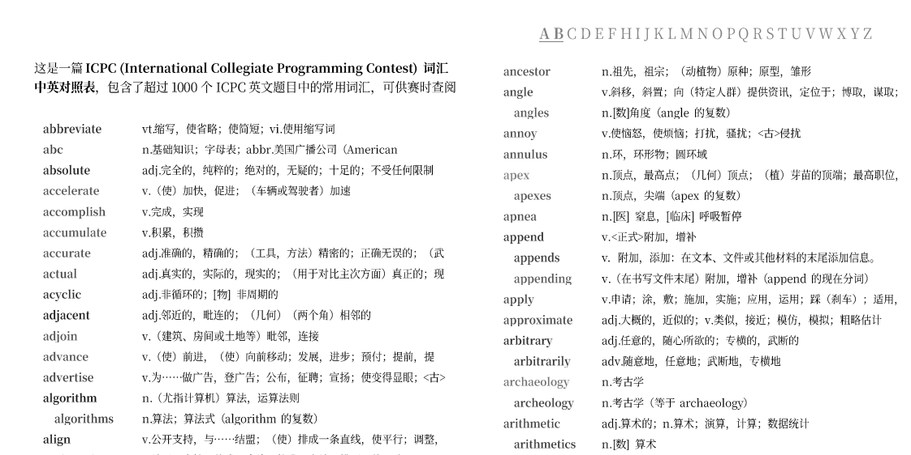

苦于英语词汇量有限，加上第一次参加英文题面的比赛，遂统计并整理了这一词汇表，以便打印出来并在赛时参考。

这一词汇表包含超过 1000 个英文词语及其中文释义，注重收录在 ICPC 比赛中出现频率显著较高、且具有一定难度的词汇，例如：*vertice 顶点 (scored 9.6), isomorph 同构 (scored 2.9), permutation 排列 (scored 5.5)*...

PDF 文件共 8 页，您可以 <b><a href="./icpc-dictionary/icpc-zh-en-dictionary.pdf">在此处下载 (12.1 MB)</a></b>

### 技术细节

您可以根据以下技术细节复现，或使用该方法创建其它词汇表。

1. 下载 ICPC 题目库 [icpcarchive/icpcarchive.github.io](https://github.com/icpcarchive/icpcarchive.github.io)、词频词典 [changhongzi/BNC_COCA_EN2CN](https://github.com/changhongzi/BNC_COCA_EN2CN)；词频词典的数据文件夹包含以 `[word].json` 命名的词汇数据，我们从中提取每个词汇 $x$ 的信息：
   - 词汇在语料库出现的频率 $x_f$（字段 `frequency`，例如 `97`）；
   - 词汇释义 $x_t$（字段 `translations`，例如 `[ "n.缩略词，缩写形式；缩略，缩写" ]`）；
   - 词汇的原型词语 $x_h$（字段 `headword`，例如 `abbreviate`）；
   - 词汇所属范围 $x_e$（字段 `examType`，例如 `[ "CET6" ]`）  

   全体词汇构成词库集 $X = \{x_1, x_2, \cdots, x_m\}$.

2. 使用 Python Docling 从 ICPC 题目库中的所有 `problems.pdf` 中提取文本内容（忽略图片），并提取其中全部的有效词语，于是每篇题目都可以构成一个序列 $P_i$，例如 $\text{\{There, is, a, grid, with, ...\}}$，全部的这些序列构成题目集 $P = \{P_1, P_2, \cdots, P_n\}$；

3. 我们规定：
   - 序列 $Q$ 的长度为 $L(Q)$；
   - 词语 $x$ 在序列 $Q$ 中出现的次数为 $F(Q, x)$；
   - 指示词语 $x$ 在序列 $Q$ 中是否出现的函数 $E(Q, x) = \begin{cases}1 &F(Q, x) > 0 \\ 0 &F(Q, x) = 0\end{cases}$.

4. 一个词语的特异性得分被定义为 **其在 ICPC 中出现的相对频率** 与 **其在通用语料库中出现的相对频率** 的对数差，这一项用于挑选那些在 ICPC 中出现次数显著多的词语，例如 *vertice 顶点*、它是图论题目中的重要词汇。公式如下：

   $$
   S_1(x) = \min ( 0, \log \frac{1 + \sum_{P_i \in P} F(P_i, x)}{\sum_{P_i \in P}L(P_i)} - \log \frac{1 + x_f}{\sum_{x_i \in X}x_{i_f}} )
   $$

   一个词语的集中度被定义为其 **在多少个题目中出现过** 与 **题目总数** 之比的对数，这一项作为惩罚项、筛除那些只在一两道题中大量出现的词语，例如 *figurines 雕像*、它只在两道题中作为背景大量出现。公式如下：

   $$
   S_2(x) = \log \frac{1 + \sum_{P_i \in P} E(P_i, x)}{1 + \|P\|}
   $$

   词语 $x$ 的总分为 $S(x) = S_1(x) + \lambda \cdot S_2(x)$，其中参数 $\lambda = 1$.  

5. 我们最终：取分数 $S(x)$ 大于 $-0.5$、且所属范围 $x_e$ 不包含 `初中` 的词汇作为最终的结果。