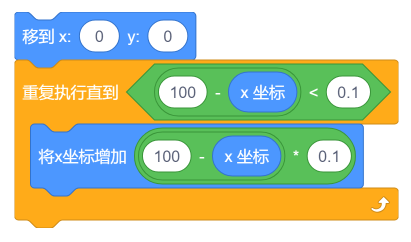
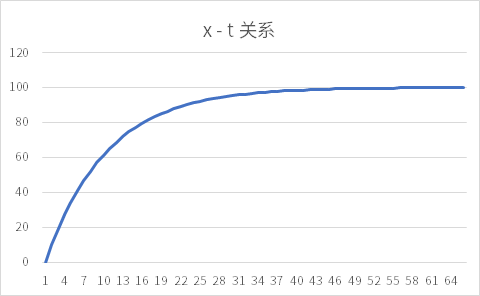

**一个奇思妙想，欢迎交流！**

## 太长不看版

对于从 $(x_0, 0)$ 运动到 $(x_1, 0)$、每帧横坐标增加 $p \cdot (x_1 - x)$ 的非线性运动，角色横坐标 $x$ 和时间（经过的帧数）$t$ 之间有：

$$
x(t) = (x_1-x_0)\cdot(p-1)\cdot(1-p)^{t-1}+x_1
$$

以从 $(0, 0)$ 运动到 $(100, 0)$、每帧横坐标增加 $\frac{100 - x}{10}$ 为例：
$$
x(t) = -90 \cdot (\frac{9}{10})^{t-1} + 100
$$

## 介绍

在动画中合理的使用非线性移动可以使动画看起来更加自然、舒适。在 Scratch 中最常用的非线性移动（之一）是这样的：

**我们以上图所展示的运动为例，角色从 $(0, 0)$ 位置非线性的移动到了 $(100, 0)$ 的位置，每帧（每次循环）都会使横坐标增加 $\frac{100 - x}{10}$，因此距离目标位置越远运动速度越快、越近运动速度越慢，是一种非线性运动**.  
下面我们将探究角色横坐标 $x$ 随时间 $t$ 变化而变化的规律.

## 推导

我们规定第一帧（经过一次循环）时 $t = 1$、第两帧时为 $t = 2$ ......

以上面提到的非线性运动为例，如果 $t = n$ 时角色的横坐标 $x$ 为 $a_n$，则：

$$
a_1 = 0 + \frac{100 - 0}{10} = 10 \\
$$
$$
a_n = a_{n-1} + \frac{100 - a_{n-1}}{10} = \frac{9}{10} a_{n-1} + 10
$$

如果通项公式形如 $a_{n} = A \cdot a_{n-1} + B$（$A, B \in R$），我们可以**构造等比数列**：

> $$
> 对于 \ a_{n} = A \cdot a_{n-1} + B\\
> \therefore a_{n} = q \cdot a_{n-1} + (q - 1) \cdot t\\
> \therefore a_n + t = q \cdot ( a_{n-1} + t ) \\
> \therefore \frac{a_n + t}{a_{n-1} + t} = q  \\
> 可得公比为 \ q \ 的等比数列 \  \{a_n + t\}
> $$ 

$$
\therefore a_n = \frac{9}{10} \cdot a_{n-1} + (\frac{9}{10} - 1) \cdot (-100) \\[0.5em]
\therefore a_n - 100 = \frac{9}{10} \cdot (a_{n-1} -100) \\[0.5em]
\therefore \frac{a_n - 100}{a_{n-1} - 100} = \frac{9}{10}
$$

现在我们得到了一个公比为 $\frac{9}{10}$ 的等比数列 $\{a_n - 100\}$.

$$
\because a_1 = 10 \\
\therefore a_1 - 100 = -90
$$

数列 $\{a_n - 100\}$ 的首项为 $-90$，我们可以得到它的通项公式：

$$
a_n - 100 = -90 \cdot (\frac{9}{10})^{n-1}
$$

因此：

$$
a_n = -90 \cdot (\frac{9}{10})^{n-1} + 100
$$

**所以对于这种情况，$x(t) = -90 \cdot (\frac{9}{10})^{t-1} + 100$.**

**更进一步，对于从 $(x_0, 0)$ 运动到 $(x_1, 0)$、每帧横坐标增加 $p \cdot (x_1 - x)$ 的非线性运动，有：**

$$
a_1 = x_0 + p \cdot (x_1 - x_0) \\
\begin{align*}
a_n &= a_{n-1} + p \cdot (x_1 - a_{n-1}) \\
    &= (1-p) \cdot a_{n-1} + p \cdot x_1
\end{align*}
$$

因此：

$$
\begin{align}
& \therefore q = 1-p, \ t = \frac{p \cdot x_1}{1-p-1}=-x_1 \\
& \therefore \frac{a_n - x_1}{a_{n-1} - x_1} = 1-p \\
& \begin{align*}
\therefore a_1 - x_1 &= x_0 - x_1 + p \cdot (x_1 - x_0) \\
          &= (x_1 - x_0) \cdot (p - 1) \\
\end{align*} \\
& \therefore a_n - x_1 = (x_1 - x_0) \cdot (p - 1) \cdot(1-p)^{t-1} \\
& \therefore x(t) = (x_1-x_0)\cdot(p-1)\cdot(1-p)^{t-1}+x_1
\end{align}
$$

使用表格验证，符合预期：

|t|Scratch 非线性移动中获取到的数据|使用 $x = -90 \cdot (\frac{9}{10})^{t-1} + 100$ 计算得的数据|
|:----|:----|:----|
|1|10|10|
|2|19|19|
|3|27.1|27.1|
|4|34.39|34.39|
|5|40.951|40.951|
|6|46.8559|46.8559|
|7|52.17031|52.17031|
|8|56.953279|56.953279|
|9|61.2579511|61.2579511|
|10|65.13215599|65.13215599|
|11|68.61894039|68.61894039|
|12|71.75704635|71.75704635|
|13|74.58134172|74.58134172|
|14|77.12320755|77.12320755|
|15|79.41088679|79.41088679|
|16|81.46979811|81.46979811|
|17|83.3228183|83.3228183|
|18|84.99053647|84.99053647|
|19|86.49148282|86.49148282|
|20|87.84233454|87.84233454|
|21|89.05810109|89.05810109|
|22|90.15229098|90.15229098|
|23|91.13706188|91.13706188|
|24|92.02335569|92.02335569|
|25|92.82102012|92.82102012|
|26|93.53891811|93.53891811|
|27|94.1850263|94.1850263|
|28|94.76652367|94.76652367|
|29|95.2898713|95.2898713|
|30|95.76088417|95.76088417|
|31|96.18479576|96.18479576|
|32|96.56631618|96.56631618|
|33|96.90968456|96.90968456|
|34|97.21871611|97.21871611|
|35|97.4968445|97.4968445|
|36|97.74716005|97.74716005|