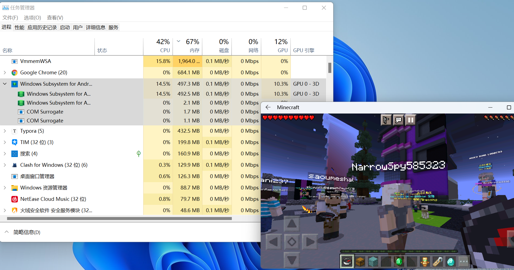

2021 年 6 月，Windows 11 发布，画了一个「在 Windows 下运行 Android」的大饼。

10 月 21 日，Windows Subsystem for Android（适用于 Android™ 的 Windows 子系统，以下简称 WSA ）终于发布。


如图所见，这是 WSA 的启动页面和设置界面，给人的第一印象是和系统结合的程度还是不错的。

WSA 暂时还不支持直接打开 APK 文件，但我们可以通过 ADB 来安装任意软件。

1. 如果你还没有配置 Platform tools，请在[这里](https://dl.google.com/android/repository/platform-tools_r31.0.3-windows.zip)下载，解压，并在命令行中进入解压过后的文件夹。

2. 进入 WSA 设置页面，开启「开发人员模式」，并重新进入 WSA 设置页面，记住 “可以在 127.0.0.1:xxxxx 上连接 ADB”中间的一串 IP 地址（通常是 `127.0.0.1:58526`，以设置中显示为准）。

3. 在命令行中执行：

   ```
   adb connect <IP地址>
   adb install <你的 APK 文件路径>
   ```

   * 在文件资源管理器中复制 APK 文件，在命令行中可以直接粘贴出它的路径。
   * 若出现「由于目标计算机积极拒绝，无法连接。 (10061)」，请尝试关闭并重新开启开发人员模式。

4. 

   惊喜的发现，酷安（或者什么其他软件你所安装的）已经被添加到你的应用列表中了！并且可以像 Windows 应用一样打开。

一些应用遵循开发规范，可以进行任意的缩放，体验比较好：


但是它的劣势还是比较明显的，

- 电脑应用的操作逻辑与移动应用有很大的不同，使用起来还是会有隔阂。

- 内存占用比较大，且目前对 GPU 的适配不太好，不能做到充分利用 GPU。

  
  

​		图为使用酷安时的资源消耗和使用 WSA 游玩 Minecraft。虽然可以使用键盘操控移动，但转动视角仍需使用鼠标拖动，并且伴有明显的卡顿和反应落后。

最后，你可以通过下方的两种方式安装 WSA：

* MSIXBUNDLE

  通过在 [Online link generator for Microsoft Store](https://store.rg-adguard.net/) 填入 WSA 于应用商店的网址：[`https://www.microsoft.com/en-us/p/windows-subsystem-for-android/9p3395vx91nr?activetab=pivot:overviewtab`](https://www.microsoft.com/en-us/p/windows-subsystem-for-android/9p3395vx91nr?activetab=pivot:overviewtab) ，并搜索（✔），在列表中找到 WSA 的 .msixbundle 安装文件：`MicrosoftCorporationII.WindowsSubsystemForAndroid_1.7.163.0_neutral_~_8wekyb3d8bbwe.msixbundle`

  ，点击以下载。

  下载完成后，打开 Powershell ，执行命令：

  ```
  add-appxpackage < .msixbundle 文件路径>
  ```

  待进度条走完便可在应用列表中找到 WSA，点击即可启动。

* 应用商店

  确保你的电脑设置中的地区设置为「美国区」（目前只对美国区用户开放测试，转区并不繁琐，也不需要验证，设置一下即可），[在商店中打开  WSA ](https://www.microsoft.com/en-us/p/windows-subsystem-for-android/9p3395vx91nr?activetab=pivot:overviewtab)，即可跳转到商店，点击安装。

