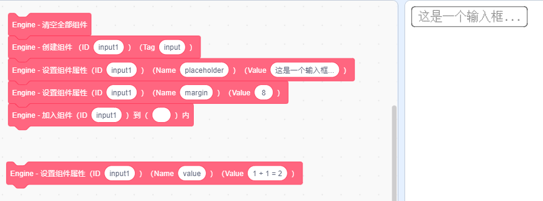

Zinc Engine 是一个在 Scratch 中渲染用户界面的工具，通过 Zinc Engine 可以仅使用代码块就快速构建出灵活的界面。


这是一个实验性项目，仍需进一步改进以提升性能。

## 预览

<div style="display: flex; justify-content: center; padding: 2em;">
   <iframe src="./zinc-engine/packaged.html" style="width: 75%; min-width: 480px; aspect-ratio: 4 / 3; border: #757575 1.5px solid;"></iframe>
</div>

<div 
   style="display: flex; justify-content: center"
>
   <a href="./zinc-engine/Zinc%20Engine.sb3" style="font-size: 1.5em; font-weight: 600">下载引擎本体及工具包</a>
</div>

## 优化

通过将作品中需要打印的文字存储为为矢量造型、在需要打印时直接图章的方式可以一定程度上地提升 Zinc Engine 的性能。通过下方的工具即可一键对使用 Zinc Engine 的作品进行优化 ↓

<iframe src="./zinc-engine/advance.html" style="height: 12em; width: 100%; border: none;"></iframe>

感谢：[Unifont](https://unifoundry.com/unifont/index.html)、[opentype.js](https://github.com/opentypejs/opentype.js)、[jszip](https://github.com/Stuk/jszip)、[crypto-js](https://www.npmjs.com/package/crypto-js)。

## 使用指南

### 入门

在开始前，请先将角色 **`【Zinc Engine】`**（引擎本体） 和 **`【Zinc Engine】工具包`** 导入到作品中。

用户界面由一个个的**组件**组成，通过提供的自定义模块可以控制组件的属性以及组件的创建、加入页面和删除，我们提供了这些自定义模块：

- **创建组件** `ID` `Tag`：创建 ID 为 `ID`、标签名为 `Tag` 的组件。
- **设置组件属性** `ID` `Name` `Value`：设置 ID 为 `ID` 的组件的属性 `Name` 值为 `Value`。
- **加入组件** `ID` 到 `TargetID` 内：将 ID 为 `ID` 的组件加入到 ID 为 `TargetID` 的组件里。
- **插入组件** `ID` 到 `TargetID` 前：将 ID 为 `ID` 的组件插入到 ID 为 `TargetID` 的组件的前面。
- **删除组件** `ID`：删除 ID 为 `ID` 的组件。
- **清空全部组件**：清空全部组件。
- **获取组件属性** `ID` `Name` ：获取 ID 为 `ID` 的组件的属性 `Name` 的值。

**上方的模块可以在角色 `【Zinc Engine】工具包` 中找到**。

**整个页面的根组件 ID 为空**，是自动创建的。整个页面的第一个组件应该被加入到这个根组件中。

这是一个 **Hello World** 页面：


（左侧的积木先是清空了组件列表，然后创建了 ID 为 `title1` 的文本组件 `Text`，创建完成后将这个组件的 `text` 属性值设为了 `Hello, world!`，最后加入到了 ID 为空的根组件中）

搭建完成后，请运行左侧的积木并点击绿旗，即可看到渲染出来的页面。 

Tips: 

- **当程序正常运行时，使用自定义模块更改组件将会自动重新渲染页面，除此之外，还可以通过广播 [ Zinc Engine - 渲染 ] 来手动渲染页面**。  
（若将 Zinc Engine 渲染的页面作为您作品的一部分、并不需要一直展示 Zinc Engine 渲染的页面，就可以关闭自动渲染、然后在需要展示页面时通过广播来渲染页面）  
- **设置组件属性前必须先创建组件。  
   将组件 A 加入到组件 B 时，组件 B 必须存在且已经被加入到了页面中。**  
   （创建组件 → 设置属性 → 加入到页面）

### 组件

- **文本组件 Text**

   这个组件类似 HTML 中的 span，用于展示文字。

   该组件有几个特色属性：

   - **文本内容 `text`**：  
      *一个字符串，该文本组件所显示的文本内容*，支持转义、换行符（`\n`）。例如 `秦时明月汉时关\n万里长征人未还`。
   - **文本大小 `fontSize`**：  
      *一个数字，默认为 `16`，为每个文字的宽高*。
   - **行高度 `lineHeight`**：  
      *一个数字，即每行文字占用的高度*。
   - **字重 `fontWeight`**：  
      *一个数字，默认为 `1`，为文字的粗细*。

   

- **盒子组件 Box**

   这个组件类似 HTML 中的 div，像是盒子一样、可以嵌套其他的组件。  

   该组件拥有两个特色属性：

   - **排列方向 `direction`**：  
      *`x` 或 `y`*。  
      默认为 `y`，Box 中的组件将按顺序从上到下排列，例如下图中最外层的 Box `box1`。  
      当值为 `x` 时，Box 中的组件会从左到右排列，例如下图中包裹着 Button 组建的 Box `box2`。

   - **允许换行 `wrap`**：  
      *`false` 或 `true`*。  
      默认为 `false`、此时无论 Box 内的内容有多长都不会换行；当值为 `true` 时，如果 Box 中的内容大于所设定的 `width` 或 `height` 时，便会自动换行。

   - **溢出行为 `overflow`**：  
      *`auto`、`visible` 或 `hidden`*。  
      默认是 `auto`，当组件内内容溢出规定的长 / 宽时会截断内容，并启用滚动以便查看全部内容。  
      当值为 `hidden` 时，组件内内容若溢出便会被截断，但不会启用滚动。  
      当值为 `visible` 时，组件内内容即使溢出也不会被截断。

   

   上图中展示的界面结构是这样的：

   ```
   Box 组件 : ( ID = "box1", boxShadow = "0 -2 10 0.15 0", margin = "8", align = "center", borderRadius = "4" )
      |
      |_ Text 组件 : ( ..... )
      |_ Box 组件 : ( ID = "box2", direction = "x", wrap = "true", width = "320", margin = "0 8", padding = "8", background = "#E8F5E9" )
         |
         |_ Button 组件 : ( ...... )
         |_ Button 组件 : ( ...... )
         |_ Button 组件 : ( ...... )
         |_ Button 组件 : ( ...... )
         |_ Button 组件 : ( ...... )
   ```
   
   - Box 组件 `box2`（包裹着按钮的）的属性 `direction` 为 `x`，因此它内部的组件是从左到右排列的；而未设定属性 `direction` 的 Box 组件 `box1`（最外层的）内部则是默认从上到下排列的。  
   - `box2` 拥有属性 `wrap` 为 `true`、且正确的设定了宽度 `width` 为 `320`，那么在它排列内部的组件时，一旦宽度到达了 320、便会自动换行。

- **按钮组件 Button**

   一个拥有预置样式的按钮组件。
   
   - **该组件拥有的特色属性和文本组件 Text 完全相同**

   **当按钮被按下时将会触发 `click` 事件，关于事件的使用方法下文会详细说明。**

   

- **单选组件 Radio / 复选组件 Checkbox**

   单选和多选按钮。

   该组件拥有特色属性：
   
   - **值 `checkbox`**：
      `true` 或 `false`。表示该组件当前的选择状态，可以读取或者设置这个值。

   **当 Checkbox 组件被点击时会触发事件 `changed` 并改变它的值，可以通过监听这个事件来得知选择状态发生了改变。**

   

- **滑动条 Slider**

   通过滑动来选择数值。

   该组件拥有特色属性：

   - **最小值 `min`**：  
      一个数字，是该滑动条可选择数值的最小值。
   - **最大值 `max`**：  
      一个数字，是该滑动条可选择数值的最大值。
   - **值 `value`**：  
      一个数字。表示滑动条当前的值，可以读取或者设置这个值。
   
   **当该组件的值改变时将会触发事件 `slide`，可以监听该事件~**

   

- **输入框 Input**

   一个输入框。

   该组件拥有特色属性：

   - **值 `value`**：  
      一个字符串。表示输入框内的值，可以读取或者设置这个值。
   - **占位符 `placeholder`**：  
      一个字符串，当值为空时显示该字符串。
   - **该组件也支持文本组件 Text 所支持的属性**

   **当该组件的值改变时将会触发事件 `input`，可以监听该事件。**

   

- **换行 Br**

   可换行的（属性 `wrap` 为 `true`）盒子组件 Box 在该组件处会立刻换行。


### 属性

通过设置组件的**属性**可以自定义组件的样式，对于可交互组件如滑动条 Slider、复选框 Checkbox 和输入框 Input，还可以通过属性 `value` 来获取该组件的当前的值。下面是**所有组件都拥有的可选属性**：

- **组件宽度 `width`、组件高度 `height`**：  
  *一个数字，即组件的宽度 / 高度*。该属性未被设置时，默认按内容大小确定组件宽度 / 高度。  
  例：属性 `width` 为 `20` 即设置组件的宽度为 20，可换行的（`warp` 属性为 `true`）盒子组件 Box 或者文本组件 Text 的宽度达到 20 后便会自动换行，如果不设置宽度、便不会自动换行。

- **内间距 `padding`、外间距 `margin`**：  
  有三种可选值：  

  1. *一个数字 `[all]`*，如 `20`，代表该组件的内 / 外间距上下左右均为 20。
  2. *两个数字 `[x] [y]`*，如 `10 20`，代表该组件的内 / 外间距上下为 10、左右为 20。
  3. *四个数字 `[top] [right] [bottom] [left]`*，如 `1 2 3 4`，代表该组件的内 / 外间距上边为 1、右边为 2、下边为 3、左边为 4。  

  也可以设置属性 `paddingLeft`、`marginLeft`、`paddingRight` ......

- **背景颜色 `background`**、**内容颜色 `color`**：  
   *一个 RGB 颜色值，为该组件的背景 / 内容颜色*。  
   例：属性 `color` 为 `#00897B` 即该组件的内容（如文本）颜色为 `#00897B`。

- **边框 `border`**：  
   *一个数字、一个 RGB 颜色值 `[borderWidth] [borderColor]`，分别是边框宽度和颜色*。  
   例：属性 `border` 为 `2 #000000` 即该组件拥有一个宽为 2、颜色为 `#000000`（黑色）的边框。

- **组件圆角 `borderRadius`**：  
   *一个数字，为组件的圆角半径*。例如 `6`。

- **显示 `display`**：  
   *`true` 或 `false`*，默认为 `true`，当设定为 `false` 时组件将不会显示。

- **阴影 `boxShadow`**：  
   *五个数字 `[offsetX] [offsetY] [blur] [opacity] [brightness]`*，分别是阴影在 X 方向上的偏移、在 Y 方向上的偏移、扩散大小、透明度（0 ~ 1）、亮度（0 ~ 100，亮度为 0 时阴影是黑色的、亮度为 100 时则是白色的）。  
   例：属性 `boxShadow` 为 `0 -2 10 0.15 0` 时，组件将拥有一个向下偏移 2、扩散 10、透明度为 0.15 的黑色阴影。

   

- **透明度 `opacity`**：  
   一个数字，范围是 0 ~ 1，代表组件的透明度。（不建议使用）

- **对齐方式 `align`**：  
   *`left` 或 `center`*，默认为 `left`，当值为 `center` 时居中对齐。

- **定位 `position`**：  
   *`default`、`relative`、`absolute` 或 `fixed`*，默认为 `default`。

   - 当值为 *`relative`* 时，支持使用 `left`、`right` 使该元素*在原本位置的基础上*进行偏移；
   - 为 *`absolute`* 时，元素“被移出文档流”、不占用空间，使用 `left`、`right` 可使该元素*在其父组件位置的基础上*进行偏移；
   - 为 *`fixed`* 时，元素“被移出文档流”、不占用空间，使用 `left`、`right` 可使该元素*在根组件位置的基础上*进行偏移。

   

- **监听鼠标悬停 `listenHover`**：  
   `false` 或 `true`。默认为 `false`。  
   当值为 `true` 时，鼠标悬停在组件上时会触发事件 `mouseover`、离开组件时会触发事件 `mouseleave`。

同时 Zinc Engine 还支持**动态属性**，使用**动态属性**可以在鼠标悬停或按下时应用不同的属性，类似 CSS 中的选择器。若要设置动态属性，请先将组件的 `listenHover` 属性设为 `true`，并设置属性名前带有 `hover:` 或 `active:` 的属性。  
若属性 `hover:background` 的值为 `#f6f6f6`，则当鼠标悬停在该元素上时，就将该元素的背景 `background` 设为 `#f6f6f6`。


### 事件

当用户和组件发生交互时会触发**事件**。当触发事件时，列表 [ Engine - 事件 ] 中会新增一项 `@[ID] [Event]` 并广播 [ Zinc Engine - 触发事件]。

如一个 ID 为 `Button1` 的按钮触发点击事件 `click` 时，列表中就会新增一项 `@Button1 click`，并广播 [ Zinc Engine - 触发事件 ]。

现在有这些事件：

- **点击事件 `click`**：  
当组件被点击时触发。所有组件都会触发。

- **鼠标按下 `mousedown`、鼠标松开 `mouseup`**：  
当鼠标在该组件处按下 / 按下后松开时触发。所有组件都会触发。

- **输入 `input`**：  
当输入组件 Input 的值改变时触发。所有的输入组件 Input 都会触发。

- **复选组件的值改变 `changed`**：  
当复选框组件 Checkbox 的值改变时触发。所有的复选框组件 Checkbox 都会触发。

- **滑动条的值改变 `changed`**：  
当滑动条组件 Slider 的值改变时触发。所有的滑动条组件 Slider 都会触发。

- **鼠标悬停 `mousehover`、鼠标离开 `mouseleave`**：  
当鼠标在该组件上悬停 / 悬停后离开时触发。只有属性 `listenHover` 为 `true` 的组件会触发。


如果希望监听事件，可以使用广播接收器，接收到广播 [ Zinc Engine - 触发事件 ] 后检查列表 [ Engine - 事件 ] 是否有希望监听的事件，如果有的话就进行对应的处理，然后**删除列表 [ Engine - 事件 ] 中的这一项事件（否则会导致事件被错误地重复触发）。**

### 提升

#### 配置

通过修改列表 [ Engine - 配置 ] 可以修改引擎的配置，格式为一项配置名、一项配置值，如：

```
@quality
8
@smoothScroll
1
@devMode
1
```

可选配置项有：

- 渲染质量 `@quailty`：正整数，0 ~ 10 之间。  
- 平滑滚动 `@smoothScroll`：默认启用平滑滚动。当这项设为 `0` 时禁用平滑滚动，适合卡顿时使用。  
- 开发者模式 `@devMode`：默认禁用开发者模式。当这项设为 `1` 时按下空格可以查看渲染所用时间（毫秒）。
- 自动渲染 `@autoRender`：默认启用自动渲染。当这项设为 `0` 时关闭自动渲染，此时用户滚动、组件属性改变都不会自动重新渲染页面，只有广播 [ Zinc Engine - 渲染] 时才会渲染。

## 声明

1. **Zinc Engine by [waterblock79](https://waterblock79.github.io/) is licensed under [CC BY 4.0](http://creativecommons.org/licenses/by/4.0/?ref=chooser-v1).**
2. **作品中内嵌了 [Unifont](https://unifoundry.com/) 15.1.04，遵守 [SIL Open Font License (OFL) version 1.1](https://unifoundry.com/OFL-1.1.txt)**，在此表示由衷的感谢！（根据 Unifont 官网：“As of Unifont version 13.0.04, the fonts are dual-licensed under the SIL Open Font License (OFL) version 1.1 and the GNU GPL 2+ with the GNU font embedding exception. The SIL OFL is available at [OFL-1.1.txt](https://unifoundry.com/OFL-1.1.txt).”）
