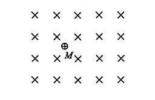
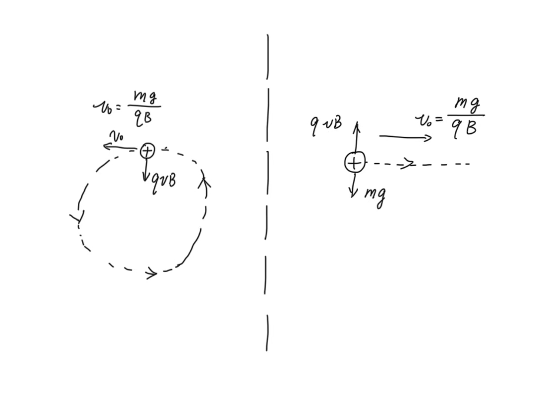
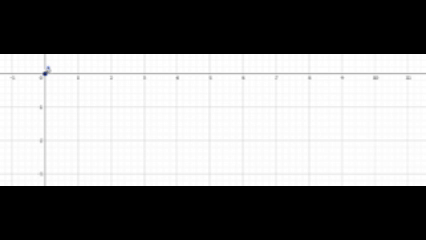

**一点思考，欢迎指正错误、提出建议！**

必修二中，我们学习过 **运动的合成与分解** 这一课，课本指出：

> 运动的合成与分解遵从矢量运算法则。

并且我们也学习了合运动和分运动间具有 **等效性**（各分运动叠加的效果与合运动相同）、**独立性**（分运动间相互独立、互不干扰）和 **等时性**（合运动和分运动同时开始与结束）。

在 2024 年北京市朝阳区一模第 20 题中，就出现了基于运动的合成与分解的考察（配速法）：

> 根据牛顿力学经典理论，只要物体的初始条件和受力情况确定，就可以推知物体此后的运动情况。  
> 情境 1：如图 1 所示，空间存在水平方向的匀强磁场（垂直纸面向里），磁感应强度大小为 B，在磁场中 M 点处有一质量为 m、电荷量为 +q 的带电粒子。已知重力加速度 g。  
> （1）若使带电粒子获得某一水平向右的初速度，恰好作匀速直线运动，求该速度的大小 $v_0$;  
> （2）若在 M 点静止释放该粒子，其运动将比较复杂。为了研究该粒子的运动，可以应用运动的合成与分解的方法，将它为零的初速度分解为大小相等的水平向左和水平向右的速度。求粒子运动过程中的最大速率。  
> ......  
>
> 

在 (1) 中，粒子受到向下的重力 $mg$ 和向上的洛伦兹力 $qv_0B$，当二者平衡时、它做匀速直线运动，有 $v_0=\frac{mg}{qB}$.

(2) 中，题目提示我们 **“可以应用运动的合成与分解的方法，将它为零的初速度分解为大小相等的水平向左和水平向右的速度”**，并且 (1) 中也提醒我们，当速度 $v=\frac{mg}{qB}$ 时，粒子做匀速直线运动，因此我们可以：

1. 将粒子的速度分解为向左、向右的两个速度，大小均为 $\frac{mg}{qB}$.

2. 1. 其中 **向右的速度 $\frac{mg}{qB}$** 在 **洛伦兹力 $qvB$** 和 **重力 $mg$**（二力平衡）的作用下，做 **匀速直线运动**、速度大小为 $qvB$.（如下图右侧）
   2. **向左的速度 $\frac{mg}{qB}$** 在 **洛伦兹力 $qvB$** 的作用下，做 **匀速圆周运动**、速度大小为 $qvB$.（如下图左侧）

   

3. 当左右两个运动速度均向右时，其合成的运动速度最大，大小为 $2qvB$，即 $\frac{2mg}{qB}$.

但是我们发现，两个分运动都各自具有一个洛伦兹力，但是合运动却只有一个洛伦兹力，所以说在分解合运动的时候，我们是让洛伦兹力凭空增加了一个吗？  
其实不然，我们可以理解为“在磁场中有速度就有洛伦兹力”，分运动具有速度、而且他们也有“独立性”，所以各自一定会有洛伦兹力，分运动的两个洛伦兹力之矢量和与合运动的一个洛伦兹力是相等的。  
类似地，如果把“弹簧拉着小球做圆周运动”正交分解成了两个“弹簧拉着小球做简谐运动”的分运动，其中弹簧的弹力是“有‘位移’就有弹力”，因此两个分运动具有两个弹力。  
但是重力是恒定的，它不因位移或者速度的改变而发生变化，所以分解时不能“一个分运动一个重力 $mg$”。

在运动的分解与合成中，我们应该把握对位移 / 速度 / 加速度（力）这三个矢量的分解与合成。例如，物体合运动的位移等于各个分运动位移的矢量和。

在这道题中，我们就可以借助这样的思想分析粒子的运动位移（轨迹）：

（以初始位置为原点，当时间 $T$ 时）

1. 分运动 **匀速直线运动** 的位移 $\vec{x_1} = (v_0T, 0)$.
2. 分运动 **匀速圆周运动** 的位移 $\vec{x_2} = (-sin\omega T, cos\omega T - 1)$.
3. 合运动的位移 
   $\vec{x} = \vec{x_1} + \vec{x_2} = (v_0T-sin\omega T, cos\omega T - 1)$.

