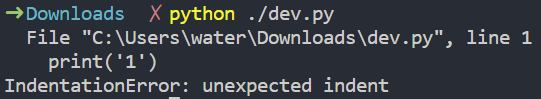
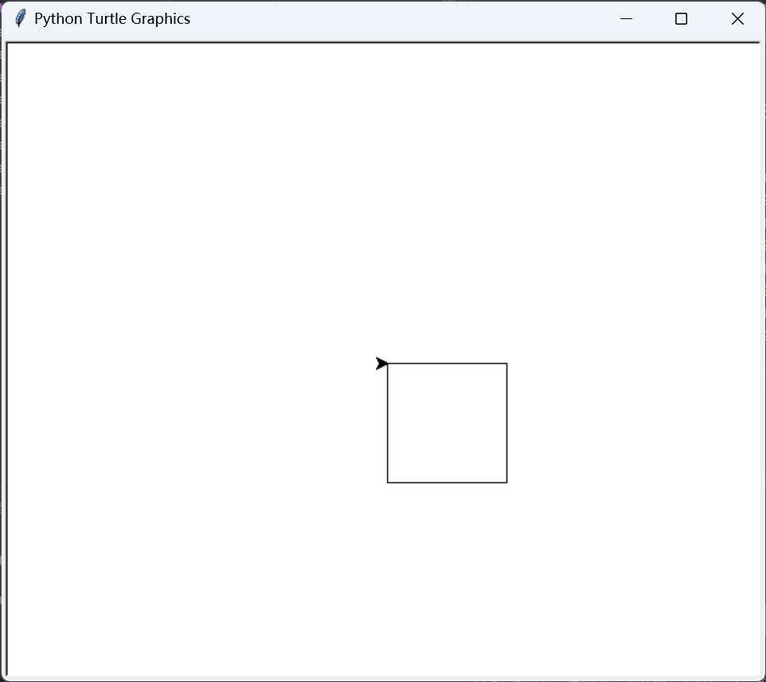
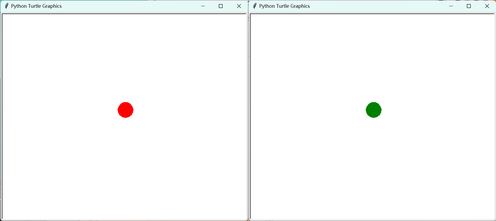
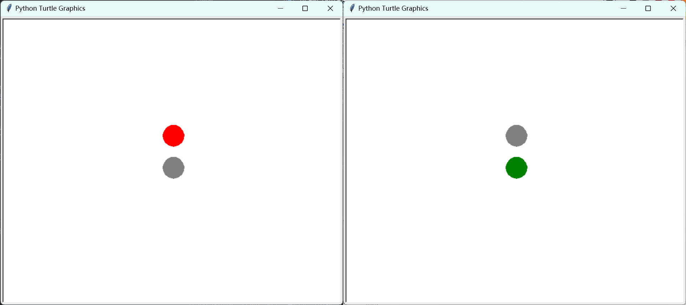

**本文内容参考了课堂笔记整理，若有错误，欢迎指正！**

## 第 1 章 认识数据与大数据

### 信息与数据

-   数据是描述事物的符号记录，是信息的载体。
-   信息和数据的关系：
    -   数据是信息的载体
    -   信息是数据所表示的意义
-   信息的表现需要借助某种载体。
-   信息的六大特征：
    -   依附性
    -   共享性
    -   时效性
    -   价值性
    -   相对性
    -   传递性

### 知识

-   知识是人们在社会实践中所获得的认识和经验的总和，是人类在实践中认识世界的成果。

### 进制

-   N 进制逢 N 进一。
-   进制的表示

    | 进制     | 英文名      | 表示方法       | 例子                  |
    | -------- | ----------- | -------------- | --------------------- |
    | 十进制   | **D**ecimal | $n_{10}$、$nD$ | 99：$99_{10}$、$99D$  |
    | 二进制   | **B**inary  | $n_{2}$、$nB$  | 5：$101_{2}$、$101B$  |
    | 八进制   | **O**ctal   | $n_{8}$、$nO$  | 80：$120_{8}$、$120O$ |
    | 十六进制 | **H**ex     | $n_{16}$、$nH$ | 255：$FF_{16}$、$FFH$ |

    > 部分计算机语言中，十六进制数可以使用类似 `0xFF` 这样来表示，二进制数可以使用类似 `0B11` 这样来表示。

-   进制的转换 **（ 1.2.2 二进制与数制转换；必修一第 17 页 ）**

    -   二转十

        -   按权展开求和

            $$
            \begin{align*}
               10101_{2} &= 1 \times 2^4 + 0 \times 2^3 + 1 \times 2^2 + 0 \times 2^1 + 1 \times 2^0   \\
                              &= 16 + 0 + 4 + 0 + 1 \\
                              &= 21_{10}
            \end{align*}
            $$

        -   或者，现在有一个二进制数 10101，快速的画出这样一个表格：

            |          |              |             |             |             |             |
            | -------- | ------------ | ----------- | ----------- | ----------- | ----------- |
            | 二进制位 | **1**        | 0           | **1**       | 0           | **1**       |
            | 该位的权 | $2^4$ ($16$) | $2^3$ ($8$) | $2^2$ ($4$) | $2^1$ ($2$) | $2^0$ ($1$) |

            如果**该位为 1**，**就把它的权加到结果中**，否则就不加。

            $$
            \therefore 10101_{2} = 16+4+1 = 21_{10}
            $$

    -   十转二

        -   除二反向取余

            现有十进制数 25，将 25 除二商 12 余 1，将 12 除二商 6 余 0，将.....：

            ```
            25 ÷ 2 = 12 ... 1
            12 ÷ 2 = 6   ... 0
            6 ÷ 2 = 3    ... 0
            3 ÷ 2 = 1    ... 1
            1 ÷ 2 = 0    ... 1
            ```

            如此计算直到商为 0，把余数从下到上串起来，得到了 11001，这就是 25 的二进制表示。

        -   或者也可以这样：

            现有十进制数 25，我们列出所有小于 25 的 $2^n$（$n∈N$）：

            $$
            16, 8, 4, 2, 1
            $$

            用其中的一些数的和来表示出 25：$16+8+1 = 25$，由此可得 25 的二进制表示 11001。

### 大数据

-   大数据（Big Data）是指那些量大且复杂到无法用传统数据处理方法来处理的数据集合。
-   大数据的特点：
    -   海量的数据规模（**巨量性**）
    -   多样的数据类型（**多样性**）
    -   快速的数据流传（**迅变性**）
    -   价值密度低（**价值性**）
-   大数据技术
    -   大数据技术是对巨量数据资源进行采集、提取、存储、分析和表达的技术。
    -   -   **大数据采集技术**是指通过物联传感、网站、社交网络等方式获得各种类型海量数据的技术。
        -   **大数据预处理技术**能提高数据质量，降低数据规模，提升数据处理的准确性。
        -   **大数据存储与管理技术**云存储和分布式管理技术
        -   **大数据分析与挖掘技术**是指从大量的、不完全的数据中，分析并提取出有潜在价值信息的过程。
        -   **大数据可视化与应用技术**

### 数据编码

> 字符是人与计算机交互过程中不可或缺的重要内容，它是多种文字和符号的总称。由于计算机只识别 0 和 1，因此在处理各种字符时，就需要将字符转换为计算机可以识别的二进制数据。

字符编码的发展：

1. **ASCII**（美国信息交换标准码，后被接受为国际标准 ISO 646）
2. **各国各自的字符编码**（**GB2312**、BIG5 等）
3. **Unicode**（1991 年，国际标准化组织和 Unicode 组织联合制定统一码）

> 计算机中存储一个“0”或“1”占用 1 个二进制位（bit）

-   1 Byte（字节） = 8 bit（位）
-   1 KB（千字节） = 1024 Byte（字节）
-   1 MB（兆字节） = 1024 KB（千字节）
-   1 GB（吉字节） = 1024 MB（兆字节）
-   1 TB（太字节） = 1024 GB（吉字节）

| 字符类型     | 所占空间     | 编码方式 |
| ------------ | ------------ | -------- |
| 任一英文字符 | 1 字节（1B） | ASCII    |
| 任一汉字     | 2 字节（2B） | GB2312   |

例：使用 GBK 编码储存 30000 个汉字所占的储存空间是？

-   30000 \* 2 B = 60000 B（需要占用 60000 字节）
    60000 B / 1024 = 58.59 KB ≈ 59 KB（需要占用约 59 KB）
    得到结论，30000 个汉字需要占用 59 KB 的存储空间。

（UTF-8 编码储存一个汉字需要占用 3 B，也就是其存储 30000 个汉字所占用的存储空间是使用 GBK 存储的 1.5 倍）

### 图像的编码

**常见图像格式：GIF（无损）、PNG（无损）、JPEG（有损）等**

一张 128px \* 128px 大小的 BMP 图片，颜色深度为 24 位，那么这张图片的大小是多少？答案是 48 kB。

BMP 图像通常不经压缩，因此 BMP 图像的大小与图像的像素数和颜色深度有关。在 BMP 图像中，每个像素其颜色所占用的二进制位数为颜色深度。颜色深度越高，图像的颜色越丰富。

$$
\begin{align*}
图像所占用的存储空间大小（单位：比特） \\
= 图像水平像素数 * 图像垂直像素数 * 颜色深度 / 8
\end{align*}
$$

颜色深度为 8 时，其占用 8 位，可以表示 $2^8 = 256$ 种颜色，也就是颜色深度为 8 时，图像的颜色为 256 种。

回到上面的例子，我们可以通过下面的公式计算出这张图片的大小：

$$
\begin{align*}
fileSize &= pixelNumsX * pixelNumsY * colorDepth / 8 \\
&= 128 * 128 * 24 / 8 \\
&= 49152 B \\
&= 48 KB
\end{align*}
$$

### 数字化与音频的编码

非数字化数据（CD、胶卷）数字化后可以变成存储在数字化设备中的数字化数据（易于**存储、处理、共享、传输**）。

$$
模拟信号 \xRightarrow{ 采样、量化、编码} 数字信号
$$

-   **采样**：  
     将连续的模拟信号转换为离散的数字信号  
     **采样频率**定义了每秒从连续信号中提取并组成离散信号的采样个数，它用赫兹（Hz）来表示。（维基百科 - 采样频率）
    采样位数：
-   **量化**：  
     将模拟声音的波形转换为数字，表示采样值的二进制位数决定了量化的精度。量化的过程是先将整个幅度划分成有限个小幅度（量化阶距）的集合，把落入某个阶距内的样值归为一类，并赋予相同的量化值。
-   **编码**：  
     将数字信号转换为二进制数据

**音频的常见格式有：APE（无损）、WAV（无损）、MP3（有损）、AMR（有损）等。**

其中 WAV 文件格式的音频文件不经过压缩，其所占存储容量：

$$
\begin{align*}
所占存储容量(B)
&= 采样率(Hz) * 采样位数 * 声道数 * 时间 / 8
\end{align*}
$$

常见的 CD 音频文件的采样频率为 44100 Hz（44.1kHz）。

例：700 MB 的 WAV 文件，采样率为 44100 Hz，采样位数为 16 位，双声道，求该音频文件时长？

1. 求出 1 分钟的、这样的 WAV 文件的大小？

    $$
      \begin{align*}
      FileSize_{pm} = (44100 * 16 * 2 * 60 / 8 ) B ≈ 10 MB
      \end{align*}
    $$

2. 求得该音频文件时长？
    $$
    \begin{align*}
    t = FileSize / FileSize_{pm} = 700 / 10 = 70 min
    \end{align*}
    $$

$$
\therefore 时长 ≈ 70 min
$$

（当然这种方法可能并不精确，如果希望得到更精确的结果，可以使用原始公式推得：$时间(s) = \frac{8 * 所占存储容量}{采样率 * 采样位数 * 声道数}$）

### 数据的压缩

在不损失有用信息的前提下，可按一定的编码规则对数据重新组合，以去除数据沉余部分。

-   有损压缩：压缩过程中损失一定信息
-   无损压缩：解压后可完全复原至压缩前状态

### 视频格式

视频画面是由以一定的速度联系播放的一组静态图像形成的，这些静态图像被称为帧（Frame）。当视频帧率（FPS，Frame Per Second）大于等于 24 时，依据视觉暂留原理，便会形成较流畅的视频画面。

**国际标准为 MPEG，无损压缩的格式有 AVI、WMV 等。**

> **流媒体**（英语：Streaming media），指将一连串的多媒体资料压缩后，经过互联网分段发送资料，在互联网上实时传输影音以供观赏的一种技术与过程，此技术使得资料数据包得以像流水一样发送，如果不使用此技术，就必须在使用前下载整个媒体文件。  
> （维基百科 - 流媒体）

## 第 2 章 算法与程序实现

**本文的目标是学习信息技术科目时的可以用于辅助参考的材料，这*不是一个专业的 Python 入门教程，请以 Python 文档为准*。**

### 算法与程序设计

算法是解决问题的步骤序列，具有有穷性、可行性、确定性，算法的描述有：自然语言、流程图、伪代码。  
程序设计语言的发展：机器语言 → 汇编语言 → 高级语言。

Python 可在 [Python 官网](https://www.python.org/) 下载，官方的简体中文文档：[点此前往](https://docs.python.org/zh-cn/3/)。  
安装 Python 后可以通过其自带的 IDLE 编辑代码，也可以使用第三方的编辑器，此处不做赘述。

### 程序设计实践

#### **Hello, World!**

```python
print("Hello, World!") # 使用 print 函数来打印一个输出：Hello, World!
```

这里我们调用了函数 print 来打印输出 `Hello, World!`，每个函数单独占一行，函数的参数放在括号中，参数之间用逗号隔开，比如你可以通过 `print("Hello,", "Beijing")` 来打印一段这样的内容：`Hello, Beijing`。

函数是可以有返回值的，比如 input 函数，input 函数接受一个参数，即提示信息，然后等待用户输入，用户输入后按下回车，input 函数就会返回用户输入的内容，比如：

```python
print('经过智能计算，你的身高是: ', input('请输入你的身高: '))
```

执行上面的函数，会先打印 `请输入你的身高: `，然后等待用户输入并回车后，会打印出 `经过智能计算，你的身高是: 【用户输入的身高】`。

```python
请输入你的身高: 175 <- 用户在控制台输入的
经过智能计算，你的身高是: 175
```

#### **运算**

我们现在接触过三种运算符：算术运算符、关系运算符和逻辑运算符。 

算术运算符有：`+`、`-`、`*`、`/`、`//`、`%`、`**` 等，分别表示加、减、乘、除、整除、取余、幂运算。  
这些运算符间有优先级，优先级从高到低依次是：`**`、`*`、`/`、`//`、`%`、`+`、`-`。

比如：`1 + 1 / 2` 会返回 `1.5`。  
再比如，下面这个式子 `1 + 2 * 3 ** 2`，它会先计算 `3 ** 2`，也就是 $3^2$，得到 9，然后再计算 `2*9`，得到 18，最后再计算 `1 + 18`，得到 19。

关系运算符可以用来比较两个值，有：`>`、`<`、`>=`、`<=`、`==`、`!=` 等，分别表示大于、小于、大于等于、小于等于、等于、不等于，这些运算符返回一个布尔值，即 True 或 False。

逻辑运算符有：`and`、`or`、`not` 等，分别表示与、或、非，用来对一个布尔值进行运算。  
对于 `and` 运算符，只有两个值都为 True 时，它才会返回 True，否则返回 False。  
对于 `or` 运算符，如果两个值中有一个为 True，它就会返回 True，否则返回 False。  
对于 `not` 运算符，它会对一个布尔值进行取反，如果 A 为 True，那么 `not A` 就会返回 False。

希望这个例子可以帮你理解这些运算符的运用：

```python
print(1 + 2 ** 2 == 1 and True)
```
这段代码将会输出：`False`。因为 `1 + 2 ** 2` 的值是 5，不等于 1，因此 `1 + 2 ** 2 == 1` 返回 False，那现在这个就变成了： `True and False` 了，返回 False。

#### **变量和类型**

使用变量可以存储一个值，变量名可以由字母、数字和下划线组成，但不能以数字开头，变量名区分大小写（比如 `Hi` 和 `hi` 就不是一个变量）。

```python
a = 1 # 初始化变量 a，将 1 赋值给 a
```

我们使用 形如 `[name] = [value]` 的语句来给变量复制，需要注意的是，这里的等号是用来赋值的，并非数学中的等于号。第一次使用变量前，需要先给他赋值来初始化，否则会报错。

```python
a = '60' # 这里我本意是想表达一个数，但为什么像其他文本一样也用双引号括了起来？请见下文变量的类型部分
print('在满分 100 分的考试中得到', a, '分就及格了。')
```

上方代码输出: `在满分 100 分的考试中得到 60 分就及格了。`

既然是赋值，那么形如这样的语句也是完全可以的：`i = i + 1`，这个语句的意思是将变量 i 的值设为原来 i 的值加上 1。

```python
a = 1
b = 2
c = a + b
print(c) # 输出 3
c = c + 1
print(c) # 输出 4
```

Python 的每个变量都有一个类型，比如整型、浮点型、字符串、布尔型等，这里我们先行介绍上面的四种，其他的类型请自行百度。

```python
a = 1 # 整型 - 一个整数
b = 1.0 # 浮点型 - 一个数，这个数可以有小数部分
c = '1' # 字符串 - 一串文字，需要用单引号或双引号括起来
d = True # 布尔型 - 只能是 True 或 False，代表真或假
```

我们可以使用函数 str() 来将一个值转换为字符串，使用函数 int() 来将一个值转换为整型，使用函数 float() 来将一个值转换为浮点型。

```python
print('他考了', str(59), '分') 
```
上方代码输出：他考了 59 分，这里使用 str 函数将整型数 59 转换为了字符串

```python
print('你的虚岁是：', int(input('输入你的年龄：')) + 1, '岁')
```
输入我的年龄 15，输出“你的虚岁是：16岁”，这里使用 int 函数将字符串 `15` 转换为了整型数 15，再进行 15 + 1运算，如果直接将一个字符串和一个整型数相加会报错的。

#### **If 分支结构**

使用分支结构来实现“当条件 X 成立时执行 Y，否则执行 Z”这样的逻辑。形如

```python
if X:
    # 代码块 Y
else:
    # 代码块 Z
```

比如，我现在想要让用户输入一个数字，然后判断这个数字是奇数还是偶数，我们可以这样写：

```python
num = int(input('输入一个数字：'))
if num % 2 == 0:
    print('这个数字是偶数')
else:
    print('这个数字是奇数')
```

首先，我们输入数字，并转换为整数类型，把这个数字存储到变量 num 中；接下来，判断这个数字取余 2 的结果是否等于 0，如果等于 0，说明这个数字是偶数，那么就执行 `if` 下面 `else` 上面的这段代码，否则就执行 `else` 下面的这段代码。  
比如，我输入 2，程序输出“这个数字是偶数”。
 
```python
if 1 > 2:
    print('Output 1')
print('Output 2')
```
上方代码输出：`Output 2`，因为 1 > 2 不成立，所以不会执行 属于分支结构的代码块：`print('Output 1')`，而是直接执行 `print('Output 2')`，这里是靠缩进来判断代码段的开始和结束的，所以属于分支结构的代码段需要前面进行一个缩进。

因此说，如果你尝试运行下面的代码，想要直接输出一个 Hello!，但却在前面多打了一个缩进：

```python
    print('Hello!')
```

它是无法正常运行的，会报：`unexpected indent` 错误（也就是控制台一大段红色的文字），因为这里不能有也不需要有一个缩进，却给了一个缩进，这是错误的。

这里再简单介绍一下报错（异常）：

> 一般情况下，在Python无法正常处理程序时就会发生一个异常。  
> （菜鸟教程）



当我们运行程序的时候，遇到类似上面的输出一般就是遇到了异常，通过程序给出的异常，我们可以快速地修复程序，来让它正常工作：

```
  File "C:\Users\water\Downloads\dev.py", line 1
    print('1')
IndentationError: unexpected indent
```

比如上面这个报错，我们可以通过 `line 1` 得知，这个错误发生在第 1 行的代码中，错误是 `IndentationError`，错误信息是 `unexpected indent`，我们可以根据这个错误发生的位置来针对性的检查并修复，并通过百度关键词：python + 报错来了解这个错误为何发生、如何解决。

#### **While 循环**

> Python 编程中 while 语句用于循环执行程序，即在某条件下，循环执行某段程序，以处理需要重复处理的相同任务。  
> （菜鸟教程）

语法形如，即当条件 X 成立的时候，执行代码块 Y，直到条件 X 不成立：
```python
while X：
    # 代码块 Y
```

让我们来写一段代码，通过 While 循环来计算 1 到 3 的和：   

先分析要求，我们需要一个变量来存储和，然后从 1 开始，循环到 3，每次循环都把当前的数字的加到和上，最后输出和。

```python
sum = 0
i = 1
while i <= 3:
    sum = sum + i
    i = i + 1
print(sum)
```

在这段代码中：

1. 我们先将变量 sum（用作存储和的计数器）的值设为 0，并将 i（用作记录这个循环是循环到了几，也就是循环变量）设为 1。
2. 然后遇到了 While 循环结构：
   1. 判断条件 i <= 3 是否成立，若成立才能执行，若不成立就退出循环。
   2. 把变量 sum 设为自身的值加上 i 的值。
   3. 把变量 i 的值加 1。
   4. 回到 1，继续判断条件是否成立，若成立则继续执行，若不成立则退出循环。
3. 最后输出 sum 的值。  

输出为 `6`。  
这样，我们就可以通过循环来出计算 1 到 3 的和了。那我直接 `print(1+2+3)` 不行吗？其实也行，但是如果遇到更大的数字，比如计算 1 到 100、1 到 10000 的和，那么这样的办法就行不通了...

#### **外部库**

在学习 Python 内置的这些基础上，我们还可以使用库所提供的一些函数，Python 就内置了一些库，如 turtle（用来绘图）等。

这里以 turtle 库为例，我们导入这个库有三种方法：

1. `import turtle`，使用 `turtle.函数名(参数)` 来调用这个库中的函数了，比如 `turtle.forward(100)`，这样就可以让乌龟向前走 100 步。  
2. `import turtle as t`，这样我们便可以使用 `t.函数名(参数)` 来调用，比如 `t.forward(100)`。  
3. `from turtle import *`，如此我们就可以直接使用 `函数名(参数)` 来调用了，比如 `forward(100)`。

其他库同理。

作为 turtle 库使用的起点，让我们画一个矩形：
```python
# 引入 turtle 库
import turtle
# 循环四次：走 100 步（画一个长度为 100 的边）、右转 90 度
turtle.forward(100)
turtle.right(90)
turtle.forward(100)
turtle.right(90)
turtle.forward(100)
turtle.right(90)
```

（我们也可以用 While 循环结构来画这个矩形，以简化代码：）
```python
# 引入 turtle 库
import turtle
# 初始化循环变量 i 为 1
i = 1
# 循环四次
while i <= 4:
    # 走 100 步（画一个长度为 100 的边）
    turtle.forward(100)
    # 右转 90 度
    turtle.right(90)
    # 循环变量加 1
    i = i + 1
```



关于 Turtle 库中我们经常使用的部分函数，可以参考下文的表格。

| 函数            | 功能                                               |
| --------------- | -------------------------------------------------- |
| `forward(d)`    | 前进 d 像素                                        |
| `backward(d)`   | 后退 d 像素                                        |
| `right(a)`      | 右转 a 度                                          |
| `left(a)`       | 左转 a 度                                          |
| `goto(x, y)`    | 移动到坐标 (x, y)                                  |
| `speed(s)`      | 设置画笔的移动速度，$\{s∈N\|0≤s≤10\}$              |
| `down()`        | 落笔                                               |
| `up()`          | 抬笔                                               |
| `setheading(a)` | 设置画笔的朝向                                     |
| `pensize(w)`    | 设置画笔的宽度                                     |
| `color(p, f)`   | 设置画笔的颜色为 p，填充颜色为 f                   |
| `circle(r, a)`  | 画一个半径为 r 的圆，a 为圆的弧度                  |
| `begin_fill()`  | 开始填充                                           |
| `end_fill()`    | 结束填充                                           |
| `clear()`       | 清空画布                                           |
| `hideturtle()`  | 隐藏海龟                                           |
| `delay(n)`      | 设置延迟，延迟大小越大动画速度越慢，$n=0$ 时无动画 |

结合 time 库中的 sleep 函数，我们可以做出一个简单的红绿灯：
```python
# 引入 turtle、time 两个库
import turtle
import time
# 将画笔延迟设为 0，也就是没有动画，然后隐藏海龟
turtle.delay(0)
turtle.hideturtle()
# 在屏幕上画出一个实心的、半径为 20 的红色圆
# 下面四个代码是先设置颜色为 red，然后开始填充，画一个半径为 20 的空心圆，最后结束填充，让这个圆变成实心的
turtle.color('red', 'red')
turtle.begin_fill()
turtle.circle(20)
turtle.end_fill()
# 停止 2 秒
time.sleep(2)
# 画出一个实心、半径 20 的绿色圆
turtle.color('green', 'green')
turtle.begin_fill()
turtle.circle(20)
turtle.end_fill()
# 画完了，执行这个语句来防止程序直接退出
turtle.done()
```
于是，现在我们看到最开始在窗口中有一个红色的实心圆（左），等待 2 秒后变为绿色（右）：  


现在，来实现一个这样的需求吧：  
屏幕上有两个灯，开始运行时上面的灯是红色的，下面的灯是灰色的，等待 2 秒，上面的灯变灰、下面的灯变绿。

这里我们引入“函数”这个概念，函数封装了一段代码，让这段代码能够被重复的调用，增加了程序的可读性、简化了程序。  
函数的定义形如：
```python
def 函数名(参数1, 参数2, ...):
    # 代码块（调用该函数的时候执行什么代码？）
```
在函数代码块里，你可以直接使用传入进来的参数，也可以使用全局变量，比如：
```python
# 函数 add 接收参数 a 和 b，并返回 a+b 的结果。
def add(a, b):
    return a + b
print(add(1, 2)) # 输出 3

# 函数 addM 接受定值 a，并返回 a 加上定值 M 的结果
# 这里在函数内直接使用了全局变量 M
M = 100
def addM(a):
    return a + M
print(addM(1)) # 输出 101
```
需要注意的是，函数外部不能调用函数内参数，比如下面这段代码就会报错：
```python
def add(a, b):
    return a + b
print(a,'+',b,'=',add(1, 2))
# 上面的代码是会报错的，因为 a 和 b 是函数的参数，在函数外面肯定是访问不到的
```

我们可以将画圆的代码封装成一个函数，然后在需要的时候调用这个函数，这样就可以大大的简化代码了：
```python
# 引入 turtle、time 两个库
import turtle
import time

# 定义一个画圆的函数 drawLighter，两个参数：颜色 color 和纵坐标 y
def drawLighter(color, y):
    # 设置颜色
    turtle.color(color, color)
    # 开始在 (0, y) 处画一个半径为 20 的实心圆
    turtle.penup()
    turtle.goto(0, y)
    turtle.pendown()
    turtle.begin_fill()
    turtle.circle(20)
    turtle.end_fill()

# 没有动画、隐藏海龟
turtle.delay(0)
turtle.hideturtle()

# 先在 (0, 30) 用函数画一个红色的实心圆
drawLighter("red", 30)
# 再在 (0, -30) 用函数画一个灰色的实心圆
drawLighter("grey", -30)
# 等待 2 秒
time.sleep(2)
# 等待 2 秒后，上面的灯变灰、下面的灯变绿
drawLighter("grey", 30)
drawLighter("green" ,-30)

turtle.done()
```

  
（程序开始运行时，上面的灯是红色的，下面的灯是灰色的，等待 2 秒，上面的灯变灰、下面的灯变绿）

#### **List 类型（列表）**

除上述提到的 4 种类型外，还有一种 List 类型，即列表。

列表是用来存储一组数据的序列。我们可以用形如这样的代码，创建一个列表类型的变量 a：
```python
a = ['Hello!', '你好！', 'Hi!', 'Hey there!', '嗨！']
```
也就是用方括号包起来，每项间用逗号隔开，列表中每个元素的类型不一定必须要是字符串，也可以是数字、布尔值，甚至可以在一个列表中放入不同类型的项目：
```python
b = [1, 2, 1, 2, 5]
c = ['A', 1, False]
```
定义列表后，我们可以通过类似于：`arr[index]` 这样的语法来访问列表中的某一项，其中 `arr` 是这个列表的名字，`index` 是这一项的下标（**列表中第一项的下标是 0、第二项的下标是 1......**）：
```python
a = ['零', '一', '二', '三']
print(a[0]) # 输出：零
print(a[3], a[1]) # 输出：三 一
```
还可以通过类似 `arr[start:end]` 的语法来取列表中的一个区间，返回一个新的列表：
```python
a = ['a', 'b', 'c', 'd', 'e']
print(a[0: 2]) # 返回 ['a', 'b']
print(a[2: 5]) # 返回 ['c', 'd', 'e']
```
也就是通过 `arr[start:end]` ，我们可以取原来的列表 arr 中下标为 start 到下标为 end - 1 的项目们.

#### **For 循环和 range**

函数 range 可以用来生成一个等差整数数列，用集合的方法来表示这个数列里的数字：（但是请注意使用 range 生成的列表是有序的）
   - `range(a)`：$\{x∈Z | 0≤x＜a \}$  
     如调用 `range(5)` 返回 `[0, 1, 2, 3, 4]`
   - `range(a, b)`：$\{x∈Z | a≤x＜b \}$    
     如调用 `range(3, 5)` 返回 `[3, 4]`
   - `range(a, b, n)`：$\{x∈Z | i∈N, x=a+n*i, a≤x＜b\}$  
      如调用 `range(6, 11, 2)` 返回 `[6, 8, 10]`
    
（$a,b,n∈Z$）

（range 函数所返回的结果是一个 range 对象。你可以通过 list 函数来将其转换为一个列表，如：`list(range(3))` 得到 `[0, 1, 2]`）

for 循环可以用来遍历一个序列，比如在这里我们就可以使用 for 循环来遍历 range 函数所返回的结果：
```python
# 遍历序列 range(3)（其实就是 [0, 1, 2]）：
# 第一次循环时把 i 的值设为序列的第一个元素（即 0）
# 第二次把 i 设为第二个元素（即 1）
# ...
for i in range(3):
    print(i) # 每次执行循环时，打印 i 的值
```
输出：
```
0
1
2
```


（图自 Runoob）

#### **break 和 continue**

使用 break 语句可以用来跳出整个循环（While 或 For）；而 continue 语句可以用来跳出当前循环的剩余语句，然后继续下一次循环。

比如这一段代码：
```python
for i in range(3):
    if i == 1:
        break
    print(i)
```
输出：
```
0
```
这个程序是这样执行的：
 - 进入第一次 for 循环，i = 0，不满足 i 等于 1，直接执行 `print(i)`，输出 0
 - 进入第二次循环，i = 1，满足 i 等于 1，执行 `break`，跳出**整个 for 循环**
 - 程序结束

而这段代码：
```python
for i in range(3):
    if i == 1:
        continue
    print(i)
```
输出：
```
0
2
```
这段程序会在执行第二次循环时，发现 i == 1，执行 `continue`，跳出**这次循环的剩余语句**，然后继续下一次循环：
- 进入第一次 for 循环，i = 0，不满足 i 等于 1，直接执行 `print(i)`，输出 0
- 第二次循环，i = 1，if 判断为真，执行 `continue`，跳出这次循环的剩余语句
- 第三次循环，i = 2，不满足 i 等于 1，执行 `print(i)`，输出 2

#### **randint 和猜数游戏**

通过 random 模块的 randint 函数，可以生成一个随机整数。比如：
```python
import random
print(random.randint(1, 10))
```
会输出一个 1 到 10 之间的随机整数。

我们可以利用这个函数加上前面了解过的 for 循环来写一个猜数游戏：
```python
# 引入 random 模块
import random 
# 使用 randint 函数来生成一个 1 到 10 之间的随机整数作为答案，并赋值给变量 answer
answer = random.randint(1, 10)
# 循环 3 次（只有三次猜数机会）
for i in range(3): 
    # 要求用户输入数字，并赋值给变量 guess
    guess = int(input('请输入一个 1 到 10 之间的整数：'))
    # 判断用户输入的数字是否等于答案
    if guess == answer:
        print('猜对了！') # 告诉用户猜对了
        break # 跳出循环    
    # 如果用户输入的数字小于正确答案
    if guess < answer:
        print('您猜的数字小于正确答案') # 提示用户猜小了
    # 如果用户输入的数字大于正确答案
    if guess > answer:
        print('您猜的数字大于正确答案') # 提示用户猜大了
# 循环结束后，告诉用户正确答案
print('正确答案是', answer)
```
```
请输入一个 1 到 10 之间的整数：5
您猜的数字大于正确答案
请输入一个 1 到 10 之间的整数：3
您猜的数字小于正确答案
请输入一个 1 到 10 之间的整数：4
猜对了！
正确答案是 4
```