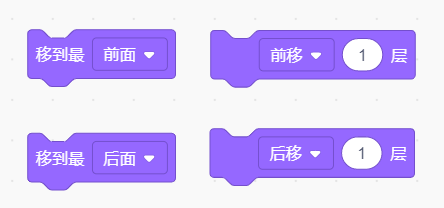
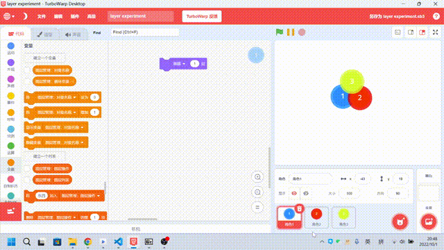
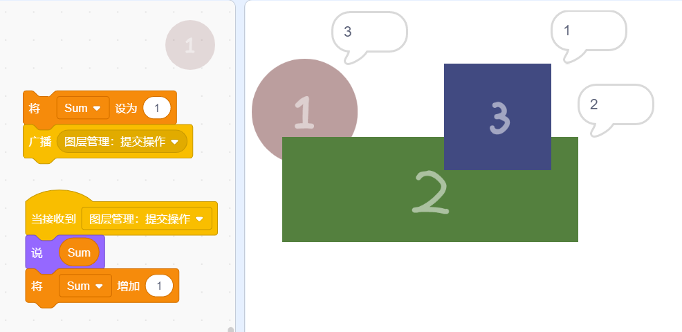
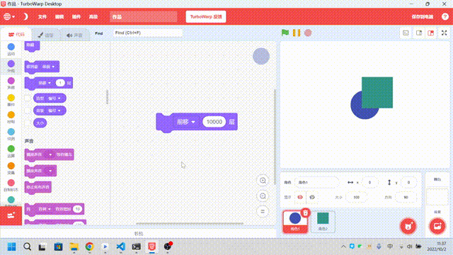
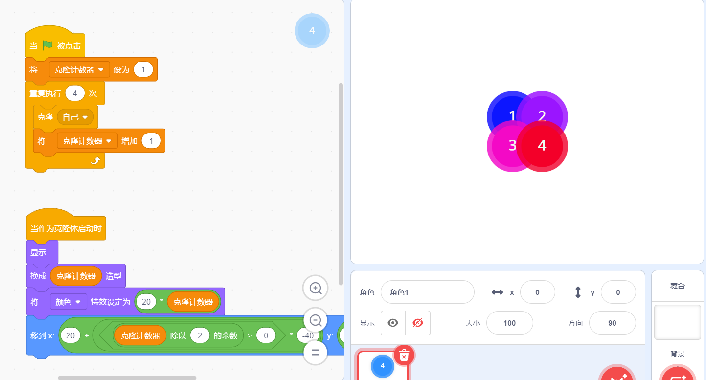
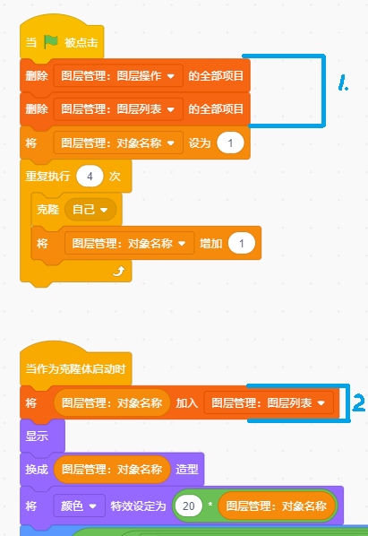
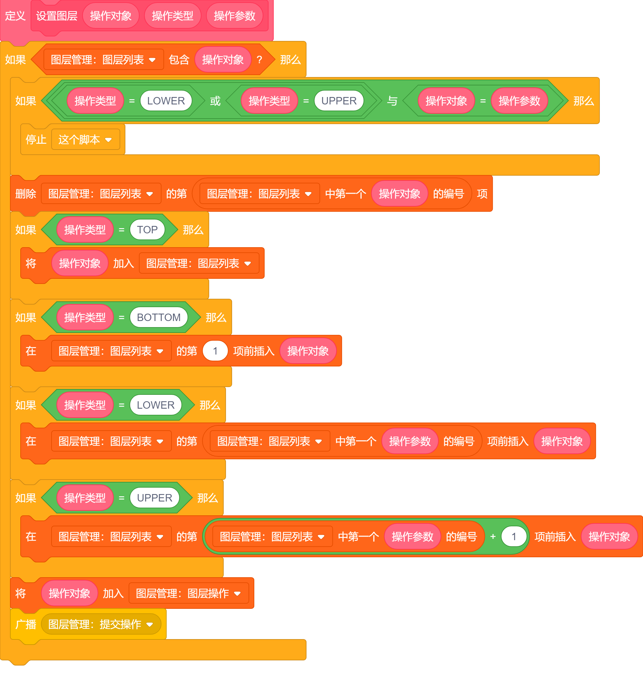
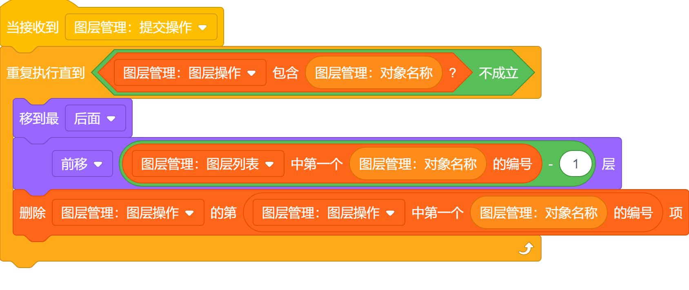
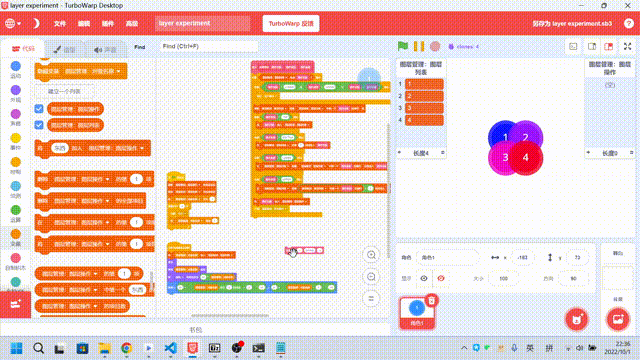

**仅供参考，如有错误，欢迎指正！**

## 开始的开始

在 Scratch 中，角色及克隆体的图层决定了它们之间先后顺序（层次关系）。在原生 Scratch 中，我们可以使用以下两个模块（四种操作）来调整图层：

## 图层的性质

### **被隐藏的角色也会占用图层。**

现在有三个角色 A、B、C，其中 A 在最下方，B 在中间，C 在最上方，如果我们将 B 隐藏，那么 A 需要上移 2 层才能够到达 C 的上方，由此可得，被隐藏的角色也会占用图层，这在我们后续实现使用列表来管理图层中至关重要。

### **图层越高的角色，越先接收到广播。**

创建计数变量 Sum，让每个角色在接收到广播时，说出 Sum 的值，并将 Sum 的值加一。我们发现：
图层最高的蓝色方块 3 说出的值最小，也就是它是最先收到广播、执行程序的。
绿色矩形 2 说出的值其次，红色圆形 1 说出的值最大，也就是它是最后收到广播、执行程序的。
由此我们可以知道：图层越高的角色，越先接收到广播。
（感谢：[图层判断 - 45848455](https://gitblock.cn/Projects/943727)）

### **图层是相对的**

将现在有两个角色：角色 1、角色 2。将角色 1 上移 10000 层，使其在角色 2 的上方。现在我们如果想要让角色 2 在角色 1 的上方，需要让角色 2 上移至少多少层呢？答案是 1，由此可见，Scratch 中的图层是相对的。

## 使用列表来管理图层

传统的图层管理方法在处理多个或未知数量的角色、克隆体间的图层关系时，会变得很棘手，因此我们便可以采用列表的方式，记录下每个对象之间的图层关系。

这种办法也有一些劣势，就是比较麻烦，尤其是在项目规模较大时，每个角色、克隆体无论是否需要用到管理图层的功能，都要生成一个自己的唯一标识并添加到图层列表中，如果要将这种方法接入到已有的项目中那就更加麻烦了。

**[下载该作品](scratch-layer/scratch-layer-manage-list.sb3)**，或在 CC 社区体验：[Scratch Layer Experiment](https://codingclip.com/project/1026)。

### 准备工作

先搭好基础的模块，创建 4 个克隆体，4 个克隆体：①、②、③、④，名称分别为 `1`、`2`、`3`、`4`，其图层顺序从最下方到最上方依次排列：

现在创建列表：“图层管理：图层操作”、“图层管理：图层列表”。添加下图中蓝色框框住的代码，使其每当角色/克隆体被创建的时候，将其的**唯一**名称添加到“图层管理：图层列表”中。

### 创建一个自定义模块，用于操作图层列表

- 自定义模块有三个参数：
  1. 操作对象：需要进行操作的对象的名称。
  2. 操作类型：代表这个操作的类型，有 4 种类型：
     1. `TOP`：移到最顶端
     2. `BOTTOM`：移到最底端
     3. `UPPER`：移到对象 [param] 的上面
     4. `LOWER`：移到对象 [param] 的下面
  3. 操作参数（param）：操作的额外参数，仅当操作类型为 `UPPER`、`LOWER` 时才需要填写，代表需要放在哪个对象的上面或下面，需传入这个对象的名称。
- 自定义模块先是判断是否出现了“自己移到自己上面（或下面）”的情况，如果是的话就直接退出；然后移动列表中这个对象的位置；最后将这个对象的名称添加到列表“图层管理：图层操作中”，并发布广播来提醒相关对象它需要修正自己的图层了。

### 搭建广播接收器

这里的私有变量 “图层管理：对象名称” 就是每个克隆体在图层操作中的名称。

需要修正图层的对象先将自己移到最后面，然后前移 自己的高度 - 1 层，举个例子：

如果现在列表为：`2、3、1、4`，我们让对象 1 先移到最后面，现在屏幕上是 1 在最底下，其次 2、3，最上面的是 4，此时我们想让 1 到达 3 的上面，上移 2 层即可（上移一层变为 2<**1**<3<4，上移两层变为 2<3<**1**<4）。

### 实际项目中的应用

这里仅仅是提供一个思路，不建议直接生搬硬套，理解最重要~

在实际项目中可以结合“**图层越高的角色，越先接收到广播**”性质来每隔几秒钟就重置一下（其实是校准）图层列表，防止列表中图层和实际图层不一致的情况。

## 利用“通过广播获取图层顺序”的特性辅助管理图层

现在有：

- 角色 A
- 角色 A 的 n 个克隆体（n > 5）：A1、A2、......、An
- 角色 B
- 角色 C
- 角色 C 的 n 个克隆体：C1、C2、......、Cn

按照图层从低到高的顺序依次排列为：A、A1、A2、...、An、B、C、C1、C2、......、Cn，现在我们希望 A2 能够移动到 B 的上方、C 的下方，（这里不能使用传统的管理办法了，因为我们不知道 C、A2 这两者上方和下方都有多少个角色、克隆体，无法直接通过“上/下移”模块移动到指定图层）用列表管理图层的办法当然可以，但是如果现在我只有这一个切换图层的需求呢？好像犯不上费这么大劲再接入列表管理图层。这时候就可以采用通过广播获取图层顺序的方法了。

先发布一个广播，让每个角色都能获取到自己的图层（参考上面在图层性质中提到的“**图层越高的角色，越先接收到广播**”），当所有角色、克隆体都接收完广播后，C 将自己的图层高度放在公用变量中，A2 收到 C 的图层高度、还知道自己的图层高度，那么就可以直接通过“上移  $h_{A2}-h_{C}$ 层”来移到“B 的上方、C 的下方”了。（用 $h_{X}$ 表示 X 的图层高度）
