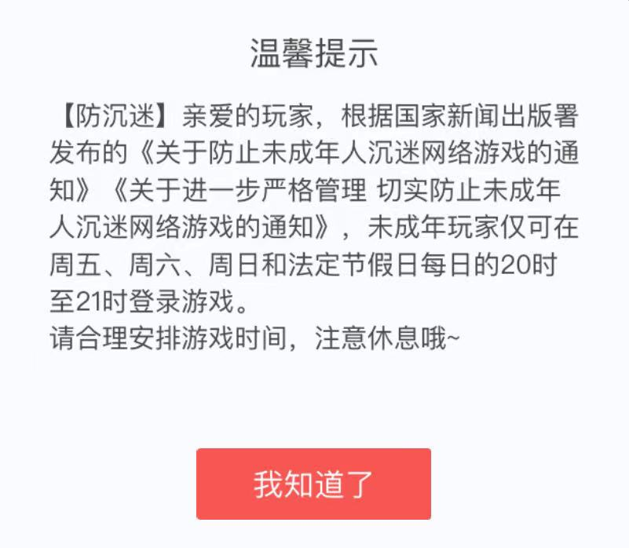
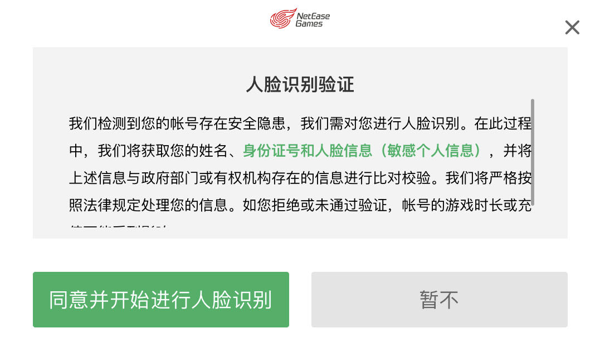

老实说，写这些东西的起因主要是我最近经常玩的网易某手游的账号因为防沉迷系统弹人脸验证所以报废了...... 所以这些话可能看起来只是“无能狂怒”而已，但是感觉对于“防沉迷”这种让人匪夷所思的事情，即使是影响不了什么的“无能狂怒”，去聊一聊自己的看法应该也总比“不服憋着”要好点 ┑(￣Д ￣)┍

## “防沉迷”系统的发展——走向严格

从 00 年代到现在，电子游戏一直有着“电子鸦片”的争议，很多人认为青少年沉迷电子游戏会对生理和心理造成负面影响。

> 近日，武汉的一位母亲奔走于新闻单位，悲痛欲绝地向记者控诉害人不浅的电脑游戏机室。根据报社编辑部的指示，记者决定暗访武汉的电子游戏厅和电脑游戏室，看看“电子海洛因”是怎样毒害孩子的，是如何泛滥成灾的。
> （[电脑游戏 瞄准孩子的“电子海洛因”](https://www.gmw.cn/01gmrb/2000-05/09/GB/05%5E18415%5E0%5EGMA2-013.htm)，2000 年 5 月 9 日）

> 数据显示，当前，我国62.5%的未成年网民经常在网上玩游戏；13.2%未成年手机游戏用户，在工作日玩手机游戏日均超过2小时。网络游戏的过度投入对我国未成年人生理和心理带来双重负面影响。2020年，我国超一半儿童青少年近视，因沉迷网络游戏而影响学业、引发性格异化的现象呈增长趋势。网络游戏危害越来越得到社会的共识，常常用“精神鸦片”“电子毒品”指代。  
> （[有孩子1天玩8小时网游！精神鸦片竟长成数千亿产业？](http://sz.people.com.cn/n2/2021/0803/c202846-34850364.html)，2021 年 8 月 3 日）

在这样的争议下，“防沉迷”系统便诞生了。

**2007 年，[《网络游戏防沉迷系统实名认证方案》](https://www.gov.cn/zhengce/WLYXFCMXTSMRZFW.doc)推行**，**未成年人使用网络游戏时间超过 3 小时以后的游戏收益便会折半、超过 5 小时降为 0**。

> ......  
> **二、开发标准**   
> ......
> **2.2促进未成年人养成健康游戏习惯**  
> 2.2.1 ......因此，需要根据在线时间的不同对未成年人的收益进行限制，超过健康游戏时间后持续在线时间越长则收益越少，直至降为零。  
> 2.2.2 为保障未成年人适度使用网络游戏并有足够的时间休息学习，对未成年人使用网络游戏的间隔时间、收益进行限制和引导。  
> 2.2.2.1 根据以上考虑，不同累计在线时间的游戏收益处理如下：  
> |累计在线时间|游戏收益|  
> |---|---|   
> |0－3小时内|正常|  
> |超过3小时后，5小时内|降为正常值的50％|  
> |5小时以上|降为0|  
> 
> ......

当时的限制看起来确实是一种良性引导，可以说这样的限制也是可以接受的，而且实名认证也没有联网验证，能够通过“身份证号生成器”这类工具来轻松地绕过限制。

**2019 年，《关于防止未成年人沉迷网络游戏的通知》发布**，在**联网实名认证**的基础上，**规定“每日 22 时到次日 8 时不得为未成年人提供游戏服务，法定节假日每日不得超过 3 小时，其他时间每日不得超过 1.5 小时”**，并且还对未成年人的游戏充值做出了限制。（见：[图表：《关于防止未成年人沉迷网络游戏的通知》提出的六方面举措](https://www.gov.cn/xinwen/2019-11/06/content_5449157.htm)）

顺便说一句，我当时是直接绑定的自己的身份证，腾讯系游戏、网易系游戏和国服 CS:GO（现在是 CS2 了）都是如此。

2021 年 8 月，《关于进一步严格管理 切实防止未成年人沉迷网络游戏的通知》发布，要求“**所有网络游戏企业仅可在周五、周六、周日和法定节假日每日20时至21时向未成年人提供1小时网络游戏服务**”、“**所有网络游戏用户必须使用真实有效身份信息进行游戏账号注册并登录网络游戏**”
（见：[国家新闻出版署关于进一步严格管理切实防止未成年人沉迷网络游戏的通知](https://www.gov.cn/zhengce/zhengceku/2021-09/01/content_5634661.htm)）。

## 沉迷游戏与否不是靠“强力”就能限制的

先抛出我的观点，**所谓“沉迷游戏”的不会因为“防沉迷”而止步、不“沉迷游戏”的反倒会被挡在“防沉迷”系统的“墙”外**。

一，绕过“防沉迷”限制习以为常，以至于发展出了“八旬老太太半夜王者峡谷拿下五杀”的段子，并且“沉迷游戏”的未成年人相对来说还愿意为绕过“防沉迷”而付出更大的代价，甚至会花钱买无“防沉迷”账号，所以说这样“密不透风”却又“漏洞百出”的“防沉迷”系统真的能防止未成年人沉迷其中吗？

> 值得注意的是，尽管未成年人游戏账号的管理趋于严格，但未成年人使用家长的账号登陆游戏，从而逃避网络游戏服务时段时长管理的情况依然存在。**数据显示，通过手机或电脑玩游戏的未成年网民中，使用家长账号玩过游戏的比例为31.9%。**  
> （[2021年全国未成年人互联网使用情况研究报告](https://news.youth.cn/gn/202211/t20221130_14165457.htm)，共青团中央维护青少年权益部、中国互联网络信息中心，2022 年 11 月）

二，要诚实守信，好，我在 2019 年节假日每天最多玩 3 小时、其他时间最多 1.5 小时的时候老老实实绑定了自己的身份证，怎么后面又变卦成了几乎不能玩的节假日晚上 8 到 9 点才能玩？说好的“诚信是金”，现在却变成了“防沉迷”有力的背刺。

三，在成年前极力限制、成年后“无限畅玩”，那这样急速的变化是否会使得青年在成年后带来更加严重的游戏沉迷（类似于“报复性消费”）呢？

四，部分家长和媒体不断推动着“防沉迷”政策的制定、政府部门来制定和推行“防沉迷”政策，他们肯定不是未成年人、而且其中的大部分可能也根本不玩游戏，那这样制定出来的政策真的是能治本的吗？

## 游戏并不是“百无是处”，更非“洪水猛兽”

要谈游戏到底是“好”是“坏”，那必须先要承认的是，未成年人过度沉迷游戏确实会带来从学习成绩下降、到引发心理问题的一系列的负面影响，并且可能导致带来恶劣且难以挽回的后果。

但是，游戏的益处也是不容忽视的，不能因为游戏存在“弊”就去极力禁止：  
一是，正如上面所说，在当今，游戏已发展为了青少年的社交生活中重要的一环；  
二是，游戏作为学习之余的娱乐的“性价比”高，手游的门槛低、时间快使得游戏可以作为学生在一天、一周的学习之余的放松；  
三是，如果不玩游戏了，那就真能去学习吗？如果不去学习，去花时间刷短视频或者像我这样写小作文那好像还不如玩游戏，至少玩 FPS、TPS 游戏能提高手眼协调能力和反应力、策略游戏能益智、热门手游还有社交属性......

因此，我们不应该去一刀切的去限制未成年人玩游戏（哪怕是恢复长时间游玩减益，避免“爆肝”带来的“沉迷”），而是应该从根本上进行引导，让游戏能给未成年人带来更大的真实价值、培养未成年人正确的价值观和世界观、让未成年人正确认识网络世界和现实世界......

## 结尾

综上，个人地认为今天的游戏“防沉迷”政策存在过于激进、不切合实际的情况，推动游戏行业良性发展、加强未成年人思想教育、恢复长时间游玩减益才会是更好的解决方案。当然说到底这些话也只是一些牢骚话而已，但我仍期待着，在未来的某一天这样的政策能够得到改善，期待着，我们的明天能更好。

